### Quickly Integrating with IBM Connections

Let's suppose that we have a Domino application which displays some quotes. Each "quote record" has several attributes *("account-number"*, *"customer"*, *"amount"*, *"total"*, *"part-number"* etc).

One of these properties (that we inherited from whoever designed our Domino application) is *"seller*": this property holds the *"email address"* of the seller who is responsible for that quote.

**We are asked to make our Domino application friendlier by displaying the *"real name"* of the seller instead of her email address.**

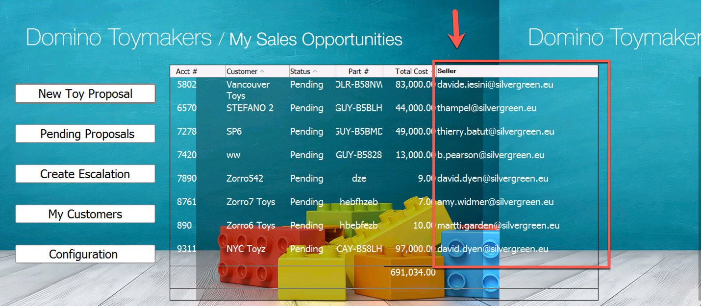

It turns out that all the sellers are in my organization and that my organization has deployed IBM Connections. The IBM Connections Profiles
module holds the information about each person in my organization: so, it would be logical to think that I would use IBM Connections to get the
*"real name"* of the seller. But it would not be logical at all to manually add the *"real name"* to each record, right

We have three possibilities to address this challenge:
-   We could use the new Domino 10 LotusScript HTTP classes to build an agent which, for each record, would go and fetch the *"real name"* from IBM Connections given the *"email address"*.
-   We could use the new **"domino-db NPM"** component and build a NodeJS application which would do the same but using the new APIs
-   We could use the new **Node-RED dominodb** package to quickly do this.

Obviously, in this article, we are going to choose the 3^rd^ option so that we can show the power and simplicity of the new **Node-RED dominodb** package.

We assume that you have a Node-RED instance up and running and that you properly installed the **Node-RED dominodb** package as described [here](/docs/Installation/)

We also assume you have installed the **IBM Connections Node-RED package** and configured it to access to your IBM Connections organization.

##### Get the documents from Domino

Let's open Node-RED and create a new Flow.

We will use the Get Documents node to retrieve the information from Domino:

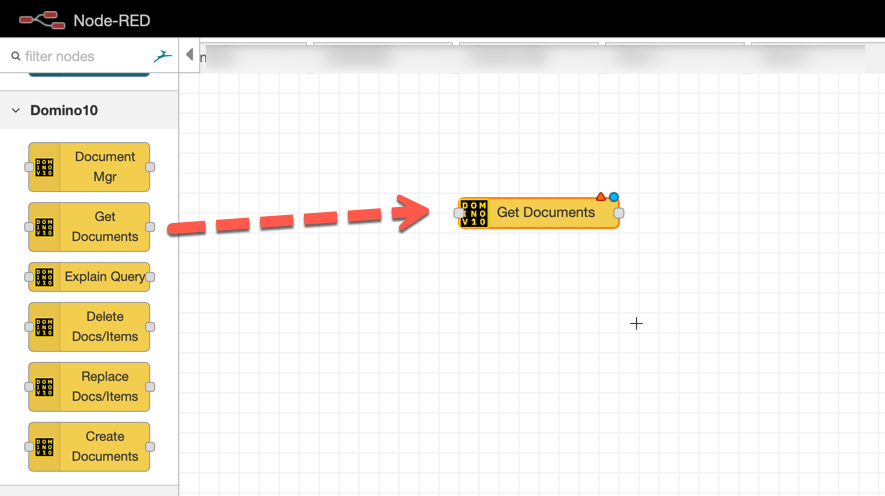

Let's open the **"Get Documents" node** in order to configure it.

The first thing we need to do is to create a connection to our Domino 10 server and to the Domino database holding our Quotes Application.

We click on the *pencil icon* associated to the Database item:

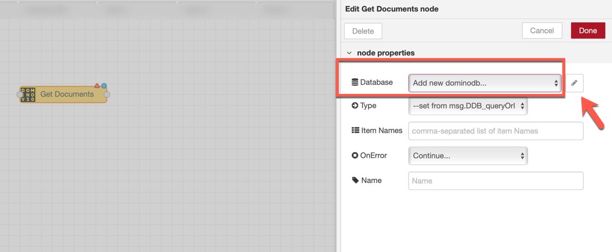

We enter the information that identify our Domino 10 server and the Domino application Database.

We give a name to this configuration so that we can reuse it later.

We, then, click on the Add button to save the configuration:

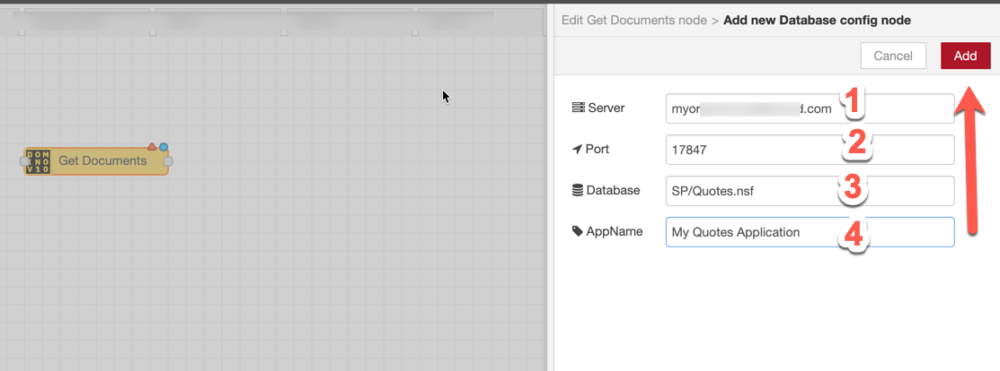

When we come back to our initial "Get Documents" node we can complete the information as follows:

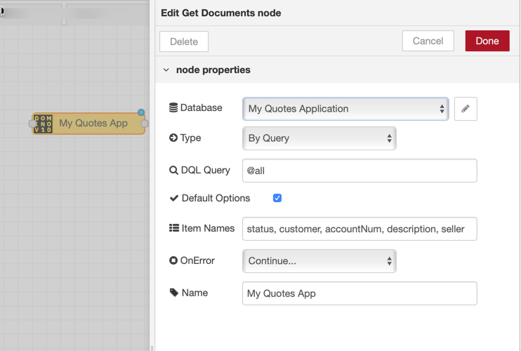

We have specified:
-   That we want to retrieve document via a DQL Query
-   The query is @all
-   That we want to retrieve the items status, customer, accountNum,
    description, seller
-   And that we want to name this node "My Quotes App"

We click the **Done button** and, then, we add an **Inject** and a **Debug node** to test what we have done.

(Do not forget to hit the **Deploy button** to make your flow executable !):

Once you click on the **purple square** on the left of the **Inject node**, you will see the results appearing in the Debug console on the right:

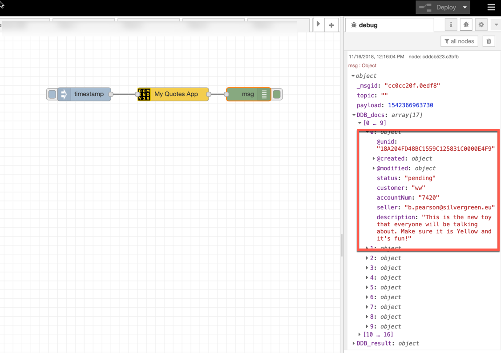

Now, we need to extract the seller information from each of the results and to pass it to the Get Profiles node from the **IBM Connections Node-RED package**.

##### Retrieve the information from IBM Connections

Let's modify our flow as follows:

We added a **Function Node** named *"Extract Seller"*.

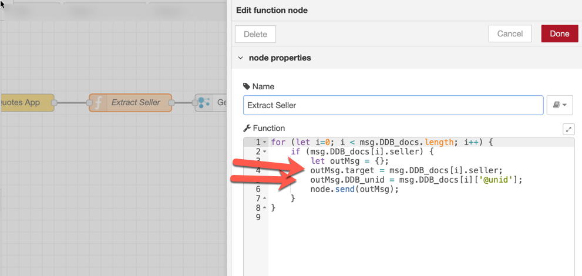

This node contains a simple Javascript fragment to:
-   Extract the *seller* and *@unid* information from each of the results coming from the **"My Quotes App" node**
-   Create an object (outMsg) that will be passed to the IBM Connections **Get Profiles node**. 
    Actually the `outMsg.DDB_unid` attribute is inserted in order for the Get Profiles node to transparently pass it further: we will need this information to update the Domino record later!

We also added an IBM Connections **Get Profile node** which is configured in this way:

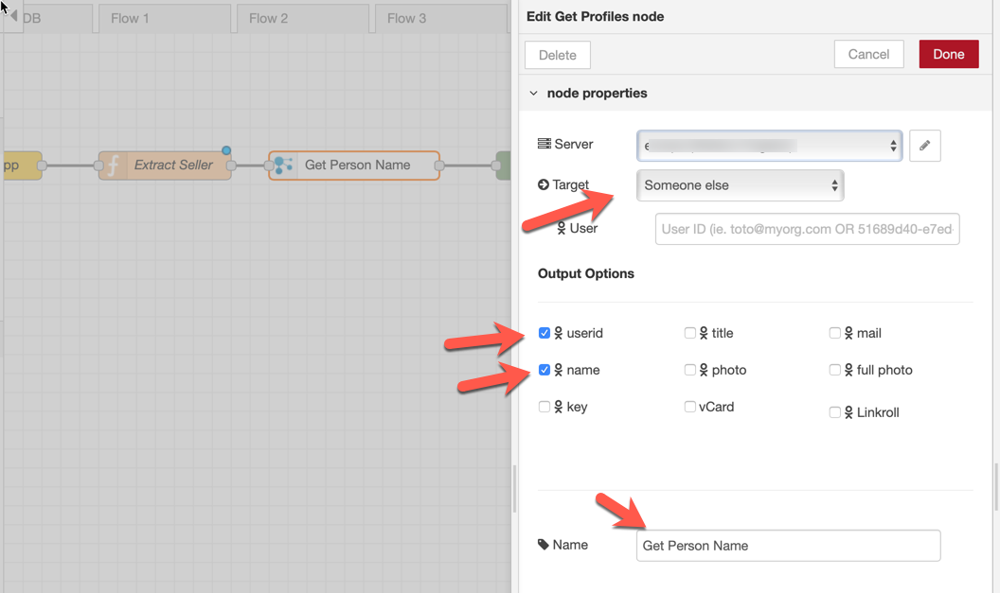

This configuration, roughly, instruct the node:
-   To get information for *"somebody else"*. This *"somebody else"* is what is specified in the *target* attribute of the out message we built in the previous **"Extract Seller" node**
-   To retrieve the *userid* and *name* attribute from the IBM Connections server specified by the Server input in the configuration

So, at this point, we told:
-   To retrieve the records from the Domino application
-   To iterate through the results and, for each result, to retrieve the *name* and *userid* attributes from IBM Connections associated with the *seller* item in the relevant Domino document

Let's hit the **Deploy button** and execute again the flow (by clicking on the **purple square** on the left of the Inject node). The results will be shown here:

For each *seller*, you will see a response from IBM Connections. The response contains the *userid* and *name* attribute as we asked!

##### Update each Domino record

Now, we want to update each Domino record by adding a *Name* attribute which contains the name of the *seller* as reported by IBM Connections.

Let's modify our flow in the following way:

We added a **Function node** (named "*Extract Name*") which is configured as follows:

The `msg.DDB_itemValues` adds the *Name* property (with a value coming from the **Get Person Name node**). 
This information is passed to the "**add Name attribute" node** which is configured as follows:

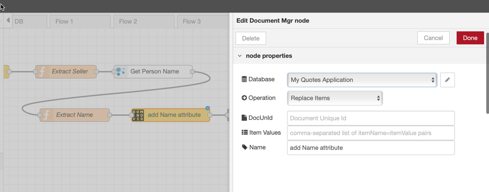

This node gets the *Item Values* and the *DocUnid* values from the output of the previous node (`msg.DDB_itemValues` and `msg.DDB_unid`) and hides the complexity of using the **"domino-db NPM"** API directly!

Let's hit the **Deploy button** and execute again the flow (by clicking on the **purple square** on the left of the **Inject node**). The results will be shown here:

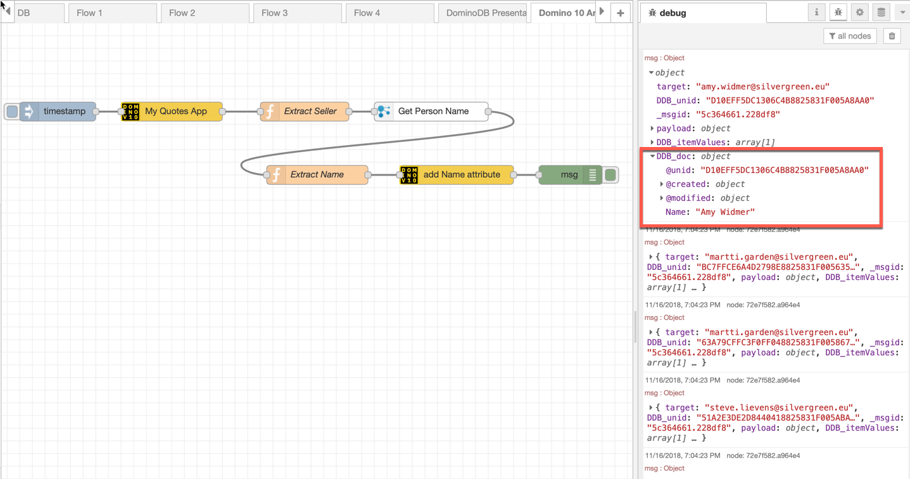

For each Document in the Domino database, we added the *Name* attribute. The `msg.DDB_doc` output attribute (highlighted in the above picture) confirms that a new Name attribute was added to the Domino Document.

Note: we could have done the whole operation in Bulk, but this would have made this simple example a little bit more complex and outside of its scope.

Let's go and modify the form in the Domino Application to display the modified records:

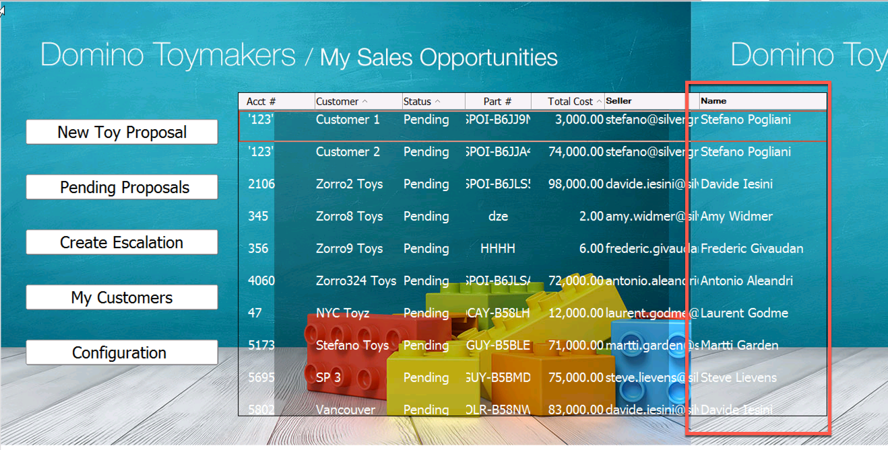
