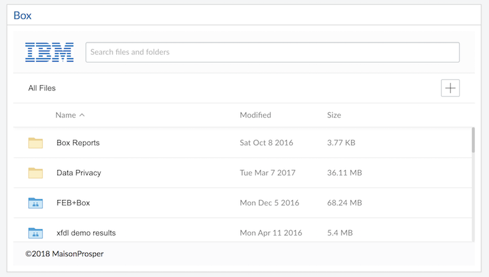
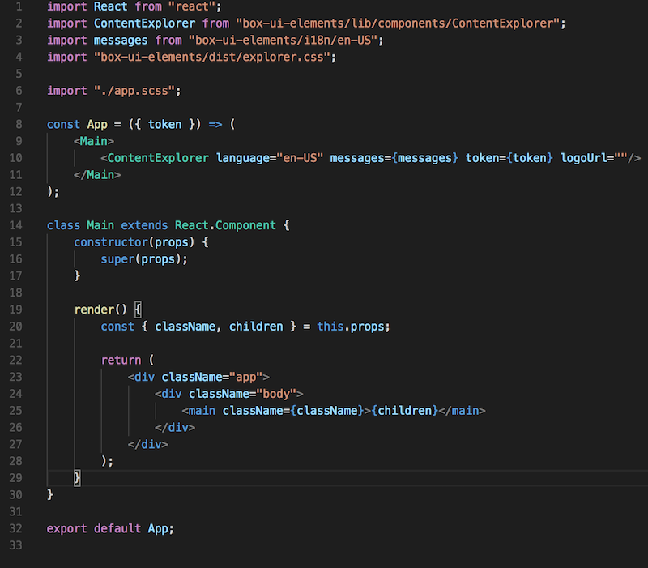

<a name="top"/>

We are going to build a widget to access files and folders from Box.  This exercise is going to help us get familiar with how to access external content, leveraging API and components provided by Box and using React.



##### 1. Create a new widget

We will now create a new widget and name it `box`; the name is important to follow along in the exercises.  In a Visual Studio Code terminal window, make sure that you are in the `icec-widgets-starter` directory. Issue the following command:

```
node scripts/createWidget.js box react
```

<br/>
##### 2. Initialize the widget

The default widget comes with a set of JavaScript modules and build tools pre-configured.  We need to install them.  Switch to the directory that was just created. Run `npm install`:

```
cd src/widgets/box

npm install
```

<br/>
##### 3. Adding sample code to the widget

In the left navigation for Visual Studio code, expand the `src/widgets/box` folder. If you do not see the box folder, click the refresh icon on the top right to update your folder list.

- Click on `index.js` to modify it.
- This widget can be surfaced as is in ICEC after running a `build` and registering it inside the custom.js.  But we already did that with the hello world widget, so we are going to make it something more interesting. We are going to access a Box folder and download and upload files via that widget. 

- This widget requires a Box Account and a Token to access the Box folder.  For the purpose of this lab, you should not use an enterprise account, so sign up for a [Box Developer account](https://developer.box.com/) and [create a Developer Token](https://blog.box.com/blog/introducing-developer-tokens/)

- Copy and paste the following javascript to replace the entire content of `index.js`.

```javascript
import React from "react";
import { render } from "react-dom";
import App from "./components/App";

const container = document.querySelector(".boxcontainer")
/* 
This token value will not work as it is not valid, register for a dev account and create a dev token: https://developer.box.com/ 
*/
let token = "hA9wlafLmDR";   

render(<App token={token} />, container);
```

We have changed the file by adding an import to a React component called `App`, and the `render` method is now passed a `token` property.  

The `App` component is a simple React component that is leveraging some Box UI components that are responsible for rendering the Box UI.  We are going to use them to display the Box folder inside our widget.  



- Save the file.

<br/>
##### 4. Build the widget

In order to make the widget available to ICEC we are going to run a `build` task that packages all the required files and deploys them to our Development server under the `/build/public` directory and also under the `dist` directory. 

- Issue the following command from a terminal window while in the `src/widgets/box` directory.

```
npm run build
```

- From the Visual Studio Code Explorer on the left panel, navigate to the `src/widgets/box/dist` and review the files there.  

- Repeat the above step for the `build/public` folder.


