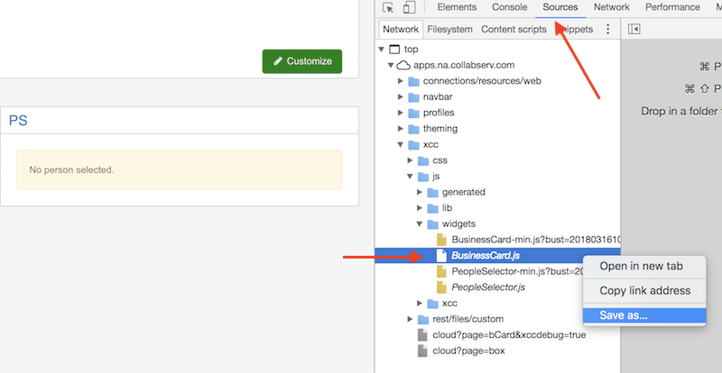
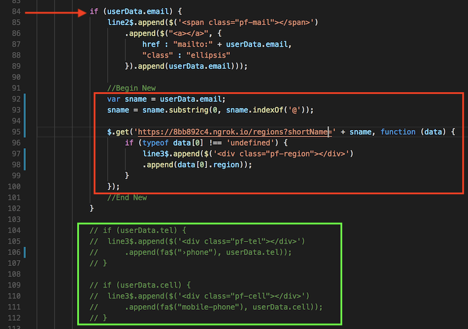
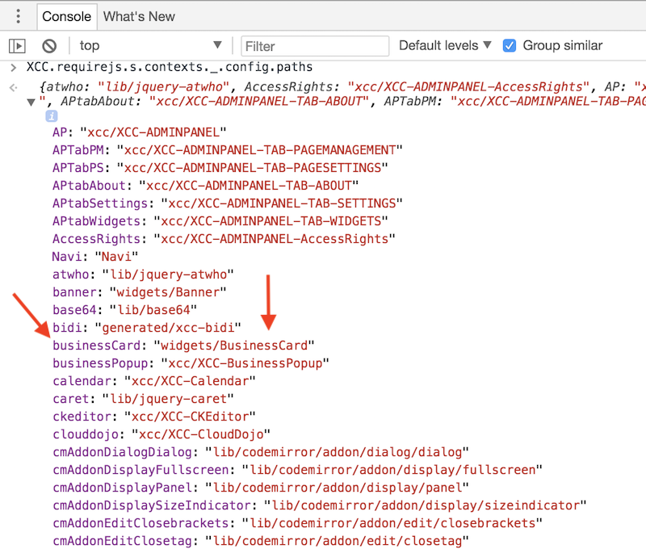

<a name="top"/>

We are going to build a widget from an existing ICEC widget.  We will create a copy of an existing widget, and to the content already provided in it by IBM Connections we will add data coming from an external content source. 

##### 1. Create a new widget

In a Visual Studio Code terminal window make sure that you are in the `icec-widgets-starter` directory. Issue the following command:

```
node scripts/createWidget.js bcard custom
```

We are going to make a copy of the Business Card widget and modify it using the following steps:

1. Click on the nagivation link for Business Card to be taken to that page. Validate by looking for the page title and the `?page=bCard` in the URL displayed by the browser.
2. By default, all widgets that are loaded on an ICEC page are minimized, so we need to make a copy of the non-minimized version. 
   - Add the `&xccdebug=true` parameter to the URL to force a download of non-minimized versions of all widgets on the current page: `https://apps.na.collabserv.com/xcc/cloud?page=bCard&xccdebug=true`. 
   - Press Enter to refresh the page with the new parameter.
3. Click **Customize** > **Widgets** > **Create Widget**. 
4. Select the `People Selector` widget from the list. In the ID field, enter a unique name **PS** and click **Create**.
5. Open the Developer Tools in your browser and change to the `Resources` tab.
6. Expand **apps.na.collabserv.com** > **xcc** > **js** > **widgets**.
7. Right-click `BusinessCard.js` and select **Save** to download the widgets.  
8. Save the widget to `/src/widgets/BusinessCard/index.js`, overwriting the one already there.



<br/>
##### 2. Initialize the widget

The default widget comes with a set of JavaScript modules and build tools pre-configured.  We need to install them.  Switch to the directory that was just created and run `npm install`.

```
cd src/widgets/bcard

npm install
```

<br/>
##### 3. Modify the widget

In the left navigation for Visual Studio code, expand the `src/widgets/bcard` folder. If you do not see the folder, click  the refresh icon on the top right to update your folder list.

- Click on `index.js` to modify it.

- First modify the section in green to comment these lines that we no longer want to show on a business card.



- Copy and paste the following JavasSript to add in the section in red.  Make sure to specify your development server's URL.

```javascript
var sname = userData.email;
sname = sname.split("@")[0];
                    
$.get('https://8bb892c4.ngrok.io/regions?shortName=' + sname, function (data) {
    if (typeof data[0] !== 'undefined') {
        line3$.append($('<div class="pf-region"></div>')
        .append(data[0].region));
    }
});
```

- Save the file.

<br/>
##### 4. Build the widget

We need to preserve some information on the original widget we copied; i.e., the originalName that is used by ICEC to register that widget. In your Chrome browser developer console, type the following command `XCC.requirejs.s.contexts._.config.paths` and press Enter. Expand the resulting object:



The BusinessCard is the widget we are modifying, and the internal name used by ICEC is `businessCard`, as seen in the screen shot above.  

Back in Visual Studio Code, in the left navigation, expand the `src/widgets/bcard` folder.

- Click on the `webpack.config.js` to modify it.

- In the widgetName variable, specify the name as `businessCard` and change the next line to use `widgetName` as seen below.


- Save the file.

In order to make the widget available to ICEC we are going to run a `build` task that packages all the required files and deploys them to our Development server under the `/build/public` directory and also under the `dist` directory. 

- Issue the following command from a terminal window while in the `src/widgets/bcard` directory.

```
npm run build
```

- In the Visual Studio Code Explorer, on the left panel, navigate to `src/widgets/bcard/dist` and review the files there.  

- Repeat the above step for the `build/public` folder.

- This widget is pure JavaScript with the HTML code inside of it, so only the .js files are produced.
