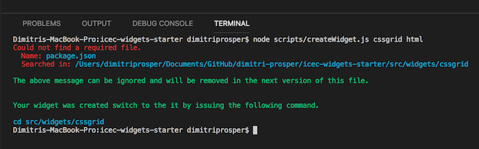
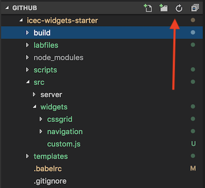

<a name="top"/>

We are going to build a very simple HTML widget that will contain a few div tags and include a custom CSS file.  This exercise is going to help us get familiar with how to use the tools provided to create, package, and deploy a widget. 

###### 1. Create a new widget

We will now create a new widget and name it `cssgrid`; the name is important to follow along in the exercises.  In a Visual Studio Code, terminal window make sure that you are in the `icec-widgets-starter` directory.

- issue the following command:

```
node scripts/createWidget.js cssgrid html
```

<br/>

<br/>

###### 2. Initialize the widget

The default widget comes with a set of JavaScript modules and build tools pre-configured.  We need to install them.  Switch to the directory that was just created.

- run `npm install`

```
cd src/widgets/cssgrid

npm install
```
<br/>
###### 3. Adding sample code to the cssgrid widget

In the left navigation for Visual Studio code, expand the `src/widgets/cssgrid` folder, if you do not see the cssgrid folder, click on the refresh icon on the top right to update your folder list.



- Click on the `index.html` to modify it.  Copy and paste the following html markup into it

```html
<div class="mpcontainer">
    <div>1</div>
    <div>2</div>
    <div>3</div>
    <div>4</div>
    <div>5</div>
    <div>6</div>
    <div>7</div>
    <div>8</div>
    <div>9</div>
    <div>10</div>
    <div>11</div>
    <div>12</div>
</div>
```

- Save the file.

###### 4. Build the widget

In order to make the widget available to ICEC, we are going to run a `build` task that packages all the required files and deploys them to our Development server under the `/build/public` directory and also under the `dist` directory. 

- Issue the following command from a terminal window while in the `src/widgets/cssgrid` directory.

```
npm run build
```

- From the Visual Studio Code Explorer on the left panel, navigate to the `src/widgets/cssgrid/dist` directory and review the files there.  

- Repeat the above step for the `build/public` folder.

###### 5. Verify that you can access the widget

- Open a browser window and try accessing the widget using the url `https://<yourdevserver>/cssgrid.html`.
