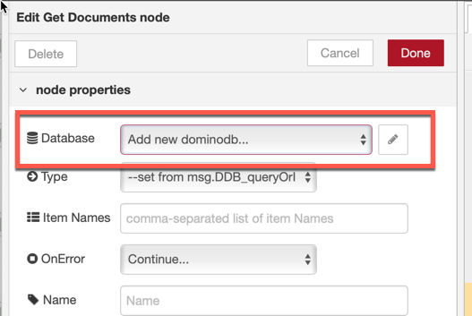

A special role is reserved to the **dominodb node**:
 
This node (a *Configuration node*, in Node-RED parlance) defines a configuration for the Domino Server and Domino Database that will be used by all the other nodes.

Since this is a *Node-RED Configuration node*, you can create multiple instances of the **dominodb node** configuration, allowing you to select on which database your other nodes will act upon; for instance, you can
create several **dominodb Configuration nodes** to represent different Domino databases (on the same Domino Server or on different servers).

### Create a dominodb node

All the nodes in the **node-red-contrib-dominodb** package (they are all described in the following sections), allow you to select the **dominodb node** that will be used via the <i style="color:red">Database dropdown selector</i>:

When you need to create a configuration for a new Domino Database on a given server, you select, from the dropdown, the `Add new dominodb...`
option and you click on the `pencil icon` on its right.  
This opens the editor for configuring a new connection:

You need to provide the details for your server (1), the port (2) and
the location of the Domino Database you want to use (3). 
We suggest adding a label (4) that will uniquely identify that Database instance.  
When you click on the `Add button`, your configuration will be created and safely stored by the NodeRED runtime.

As mentioned above, you can have multiple **dominodb configuration nodes** and they will all be available via the <i style="color:red">Database dropdown selector</i> for all other nodes in the package.

You can modify any previously created **dominodb configuration node** by  selecting it from the <i style="color:red">Database dropdown selector</i> which is available on any other node and clicking on the <i style="color:red">pencil icon</i>:

