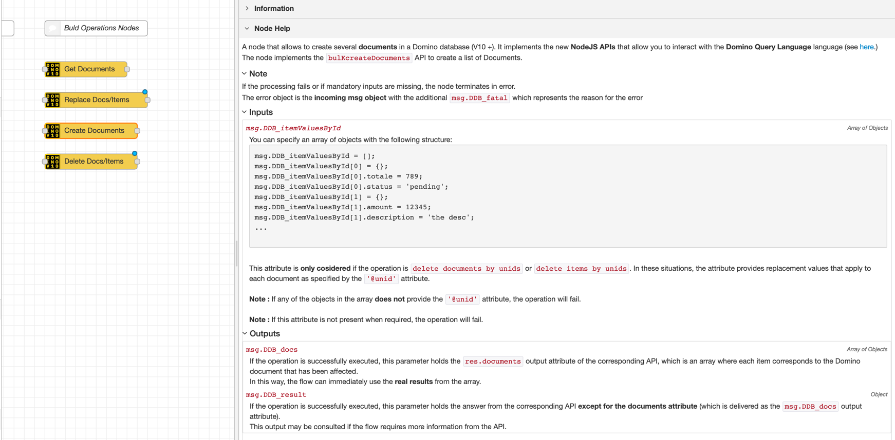
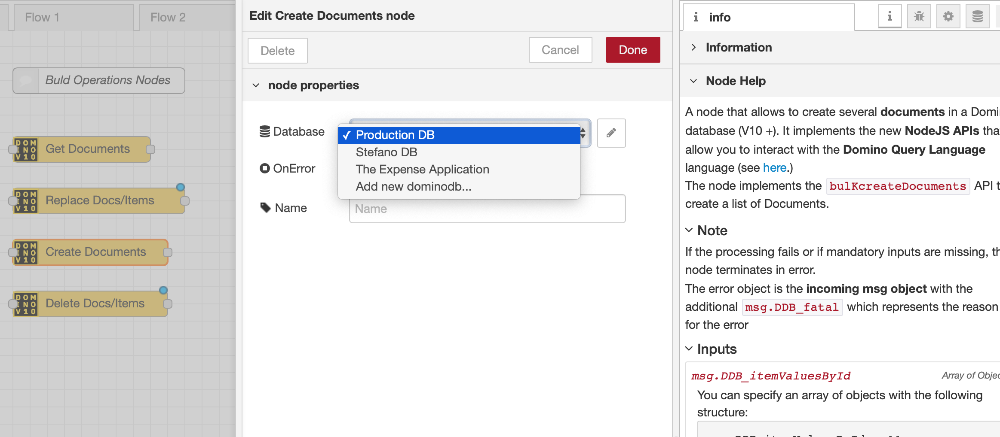
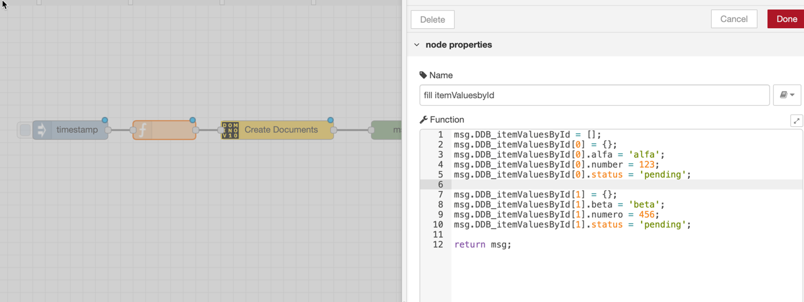
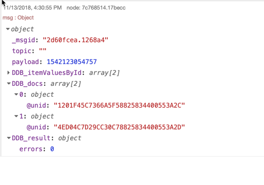

A node that allows to create one or more **documents** in a Domino database (V10 +). It implements the new **NodeJS APIs** that allow you to interact with the **Domino Query Language** [language](https://www-01.ibm.com/support/docview.wss?uid=ibm10729047).  
The node implements the `bulkCreateDocuments API` from the **dominod-b NPM ** package.

Clicking on any instance of the node, you can see the online help in the
rightmost panel of the Node-RED editor: 

The help describes the behavior of the node as well as all the input and
output parameters for the node itself.

### Selecting the Domino Server and Database
You can select the instance of the Domino Database that will be used by this node by means of the
<i style="color:red">Database selector</i>: 
 

This provides access to the library of **dominodb configurations**.

This node is very simple to use. 
In order to provide information for creating the new documents, we need to go back to the API used in this situation, which is the `bulkCreateDocuments API`.  
This API accepts, among other parameters, an array of objects, where each object holds the name and values of the items that will be assigned to the new Domino documents that will be created. 
It is not really simple to manually create a complex array of JSON objects and enter it in an input text. So, the `msg.DDB_itemValuesById` input attribute will be used. 
Here below is a simple example of how this attribute can be created using a
**Function Node** and passed to **the Create Documents node**.

{

### Output

If the execution of the node successfully completes, the following
outputs will be provided:

The `DDB_docs` array provides a list of Unique Ids representing the documents that have been created.  
The `DDB_result` object contains the additional outputs provided by the API.
