A node that allows to delete **documents** or **items** from a Domino database (V10 +). It implements the new **NodeJS APIs** that allow you to interact with the **Domino Query Language** [language](https://www-01.ibm.com/support/docview.wss?uid=ibm10729047). 
The node implements the following APIs
-   `bulkDeleteDocuments API`  
    to delete a list of Documents retrieved by a **DQL Query**
-   `bulkDeleteDocumentsByUnid API`  
    to delete a list of Documents specified by a **list of unids**
-   `bulkDeleteItems API`  
    to delete a list of Items from the Documents retrieved by a **DQL Query**
-   `bulkDeleteDocumentsByUnid API`  
    to delete a list of Items from the Documents specified by a **list of unids**

Clicking on any instance of the node, you can see the online help in the
rightmost panel of the Node-RED editor: 
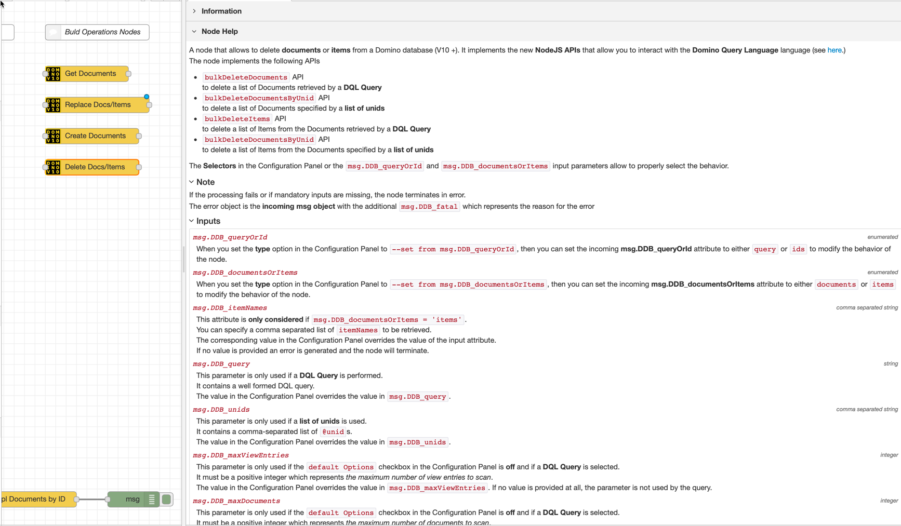

The help describes the behavior of the node as well as all the input and
output parameters for the node itself.

### Selecting the Domino Server and Database

You can select the instance of the Domino Database that will be used by this node by means of the <i style="color:red">Database selector</i>: 
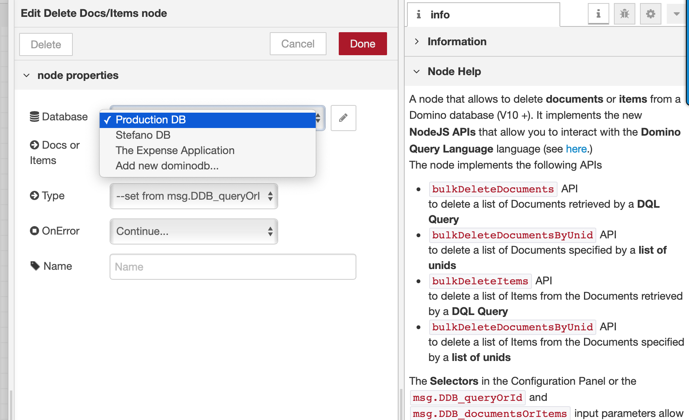 

This provides access to the library of **dominodb configurations**.

### Selecting the target

By means of the <i style="color:red">Docs or Items selector</i>, you can choose to delete entire documents or the value of selected attributes within the selected documents. 
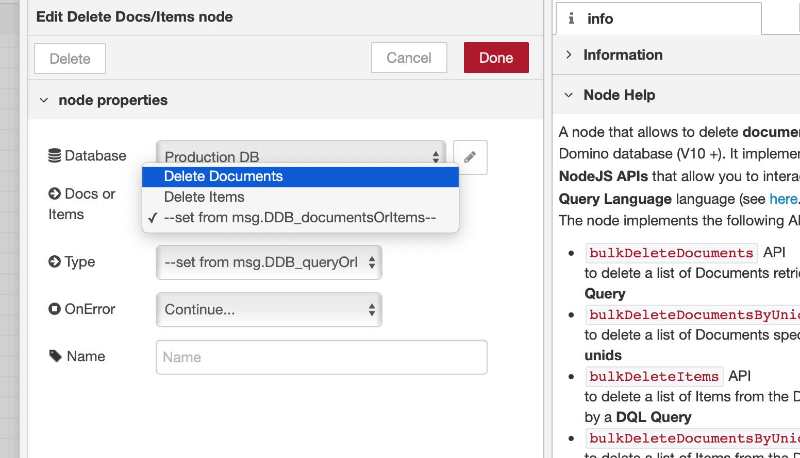

It is, also, possible to configure the node to delegate to the incoming `msg.DDB_documentsOrItems` attribute the kind of operation to be performed. This is useful when, in your flow, you may want to decide which type of operation to perform based on the status of your flow. The accepted values for this attribute are `documents`or `items`.

### Selecting the operation

By means of the <i style="color:red">Type selector</i>, you can choose to delete the documents identified by a **DQL Query** or by the list of Unique Ids associated to each document. 
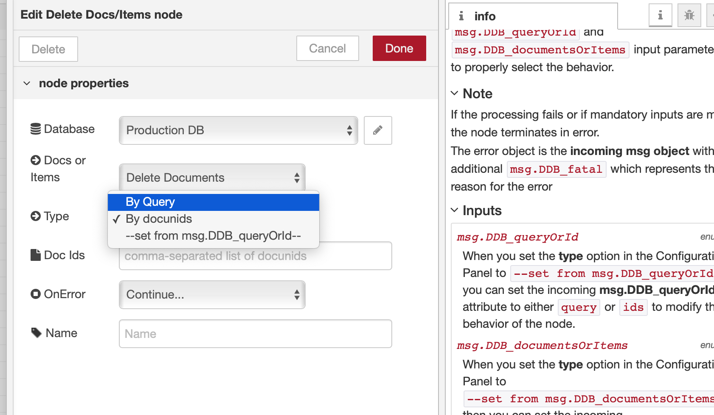

It is, also, possible to configure the node to delegate to the incoming
`msg.DDB_queryOrIds` attribute the kind of operation to be performed. 
This is useful when, in your flow, you may want to decide which type of
operation to perform based on the status of our flow. The accepted values for this attribute are `query`or `ids`.
-   In this case, you will also have to provide a value to the input attribute for the **DQL Query** string (as `msg.DDB_query`) or for the list of Unique Ids (as `msg.DDB_unids`).

## Deleting Documents by Query

If you elected to delete entire documents by Query, you will see the
following panel:

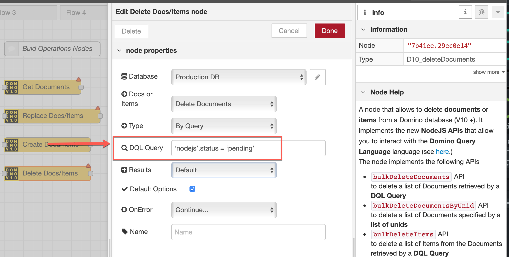

You can specify a valid **DQL Query** (in the above picture `'nodejs'.status = 'pending'` ). 

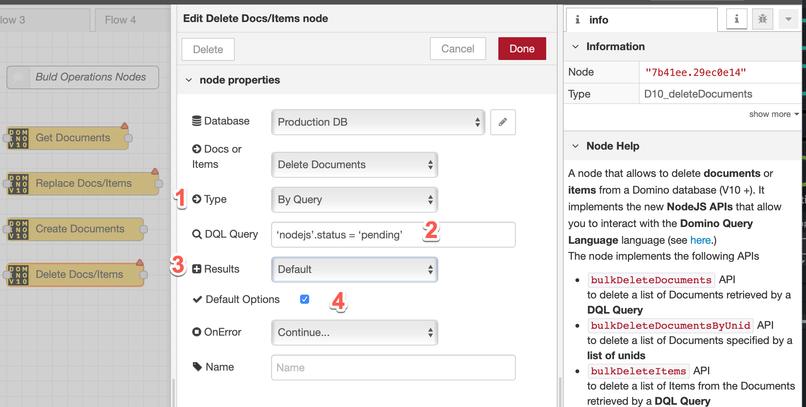

In the above picture:
-   The <i style="color:red">DQL Query input</i> can be left empty in the editor. You can use the `msg.DDB_query` input attribute to provide the information at runtime.
-   The <i style="color:red">Results selector</i> allows to define the documents that will be deleted. 
     
    The possible values are: 
    -   **Default**: 
        In this case the query will be executed without specifying any
        *start* and *count* parameters. Only those documents which match
        the default criteria (from index "0" to index "99") will be
        deleted
    -   **All Documents** 
        In this case the items for all the documents matching the query
        will be deleted. 
        Be aware that this may be a huge number which may make your
        NodeRED environment getting out of Memory.
    -   **By Page** 
        In this case, you will be asked to specify the *start* and
        *count* parameters in order to delete "**count documents starting
        at the start index**"
        -   The *start* and *count* parameters can also be specified by using 
            the incoming `msg.DDB_startValue` and `msg.DDB_countValue` attributes. 
            The values in the configuration panel override the incoming
            values.
    -   <strong>---set from DDB_displayResults--</strong> 
        The incoming `msg.DDB_displayResults` can be used to provide the
        information at runtime. Valid values are "**Default**",
        "**All**" and "**byPage**".
-   we are using *Defaults* for the query. You can override them by
    unchecking the <i style="color:red">Default Options checkbox</i> and specifying different values for the `Max View Entries`, `Max Documents` and `Max Milliseconds` parameters). 
    

## Deleting Documents by ID

If you elected to delete entire documents by Query, you will see the
following panel:
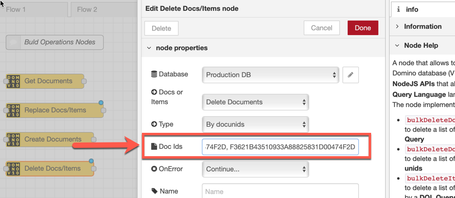 
You can specify a comma-separated list of **unique Ids** (in the above picture `F3621B43510933A88825831D00474F2D, E2510A3A32409822F77714720C99363E1C`).
-   The <i style="color:red">Doc Ids input</i> can be left empty in the editor. You can use the `msg.DDB_unids` input attribute (which is, also, a comma-separated list of unique ids) to provide the information at runtime.

## Deleting Items by Query

If you want to delete items within documents by specifying a **DQL Query**, you will see the following panel:

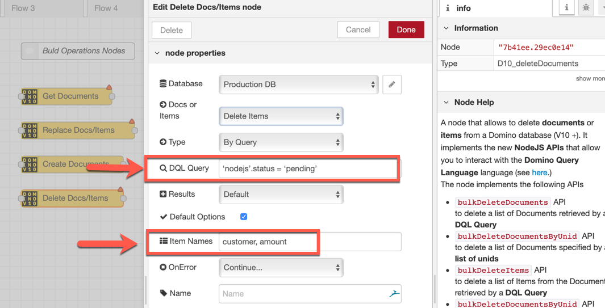

You can specify a valid **DQL Query** (in the above picture
`'nodejs'.status = 'pending'` ) and a comma-separated list of item names
(in the above picture `customer, amount`). The <i style="color:red">Item Names input</i> field defines the names of the items that will be removed from the selected documents.

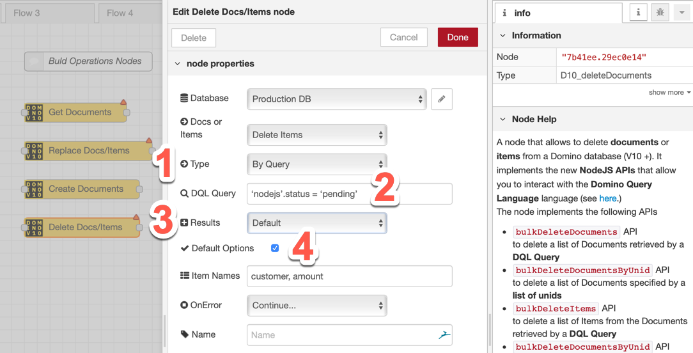

In the above picture:
-   The <i style="color:red">DQL Query input</i> can be left empty in the editor. You can use the `msg.DDB_query` input attribute to provide the information at runtime.
-   The <i style="color:red">Results selector</i> allows to define the documents that will be deleted. 
    The possible values are: 
    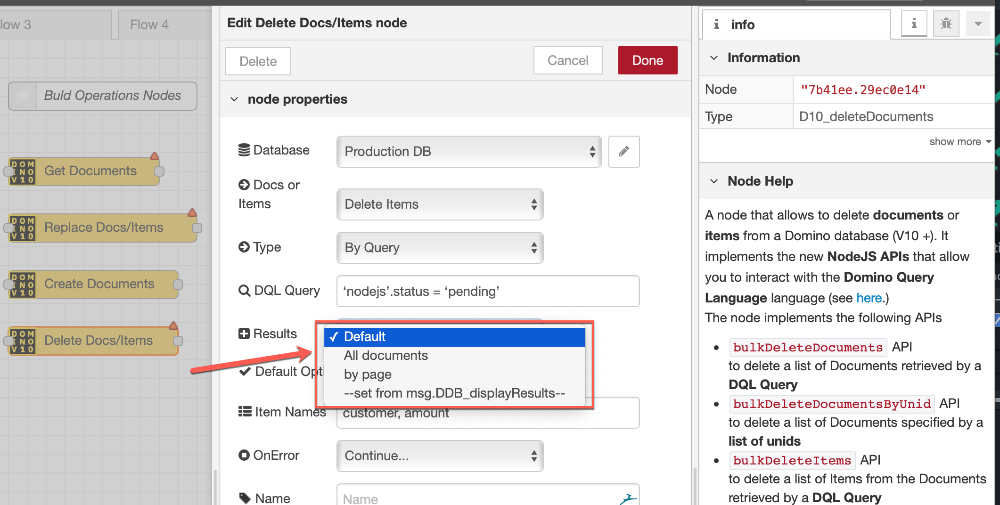
    -   **Default**: 
        In this case the query will be executed without specifying any
        *start* and *count* parameters. The specified items for those
        documents which match the default criteria (from index "0" to
        index "99") will be deleted
    -   **All Documents** 
        In this case the items for all the documents matching the query
        will be deleted. 
        Be aware that this may be a huge number which may make your
        NodeRED environment getting out of Memory.
    -   **By Page** 
        In this case, you will be asked to specify the *start* and
        *count* options in order to delete the specified items for
        "**count documents starting at the start index**"
        -   The *start* and *count* parameters can also be specified by
            the incoming `msg.DDB_startValue` and `msg.DDB_countValue` attributes. 
            The values in the configuration panel override the incoming
            values.
    -   <strong>---set from DDB_displayResults--</strong> 
        The incoming `msg.DDB_displayResults` can be used to provide the
        information at runtime. Valid values are "**Default**",
        "**All**" and "**byPage**".
-   we are using *Defaults* for the query. You can override them by     unchecking the <i style="color:red">Default Options checkbox</i> and specifying different values for the `Max View Entries`, `Max Documents` and `Max Milliseconds` parameters). 
    
-   The <i style="color:red">Item Names input</i> can be left empty in the editor. You can use the `msg.DDB_itemNames` input attribute (which is a comma-separeted list of item names).

## Deleting Items by Unique Ids

If you want to replace items within documents by specifying a list of
**unique ids**, you will see the following panel:

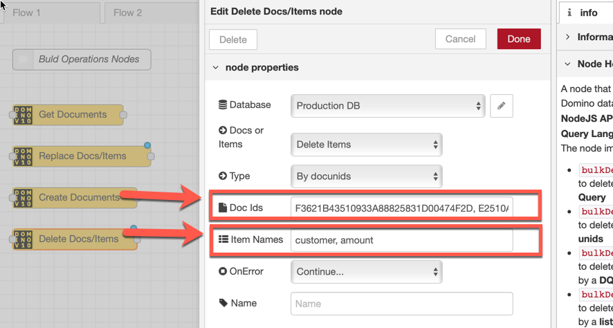

You can specify a comma-separated list of **unique Ids** (in the above
picture `F3621B43510933A88825831D00474F2D, E2510A3A32409822F77714720C99363E1C`) and a comma-separated list of item names (in the above picture `customer, amount`). 
The <i style="color:red">Item Names input</i> field defines the items that will be removed from the selected documents.
-   The <i style="color:red">Doc Ids input</i> can be left empty in the editor. You can use the `msg.DDB_unids` input attribute (which is, also, a comma-separated list of unique ids) to provide the information at runtime
-   The <i style="color:red">Item Names input</i> can be left empty in the editor. You can use the `msg.DDB_itemNames` input attribute (which is a comma-separeted list of item names).

### Output

If the execution of the node successfully completes, the following
outputs will be provided:

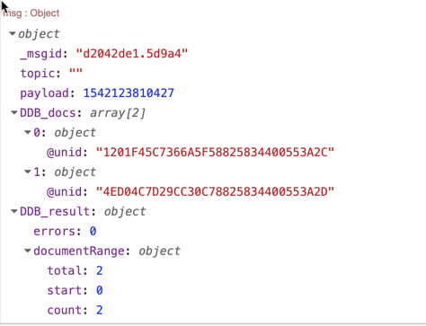

The `DDB_docs` array provides a list of Unique Ids representing the documents that have been created.  
The `DDB_result` object contains the additional outputs provided by the API.

