A node that allows to perform CRUD operations on a **Single Document** in a Domino database.  
This module implements the following new **NodeJS APIs**
-   `useDocument`
-   `read`
-   `createDocument`
-   `replace`
-   `replaceItems`
-   `delete`
-   `deleteItems`

Clicking on any instance of the node, you can see the online help in the rightmost panel of the Node-RED editor: 
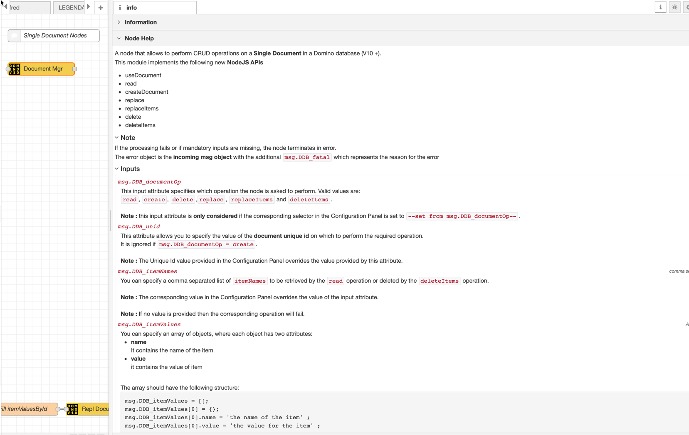

The help describes the behavior of the node as well as all the input and output parameters for the node itself.

### Selecting the Domino Server and Database
You can select the instance of your Domino Database using the <i style="color:red">Database selector</i>: 
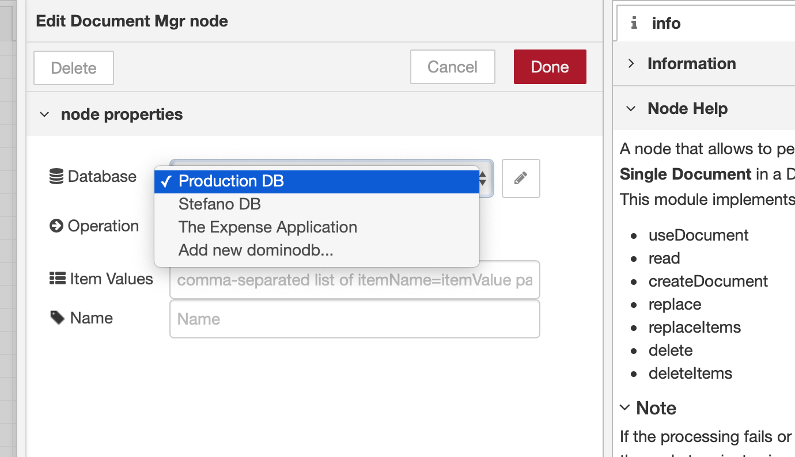 

This provides access to the library of **dominodb configurations**.

### Selecting the operation
By means of the <i style="color:red">Operation selector</i>, you can choose which operation you want to perform on a given Document.

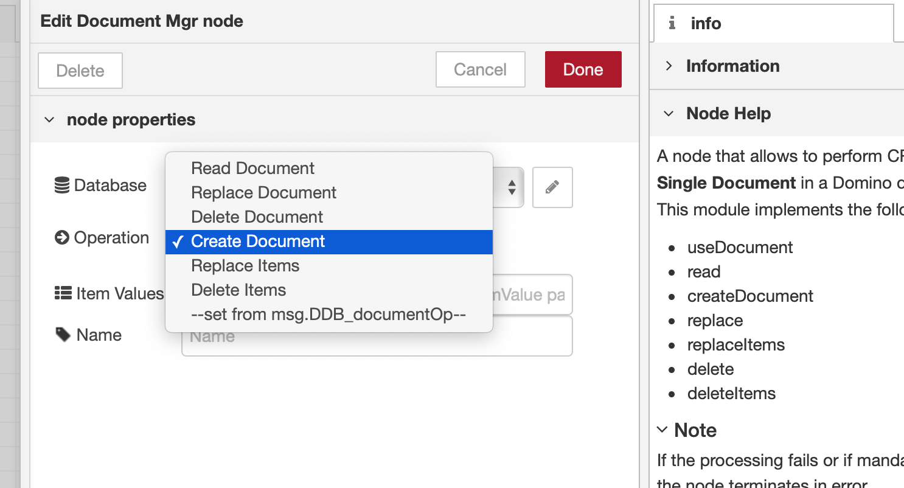

It is, also, possible to configure the node to delegate to the incoming `msg.DDB_documentOp` attribute the kind of operation to be performed. 
This is useful when, in your flow, you may want to decide which type of operation to perform based on the status of your flow. The accepted values for this attribute are **read**, **create**, **delete**,**replace**, **replaceItems** and **deleteItems**

## Read Document

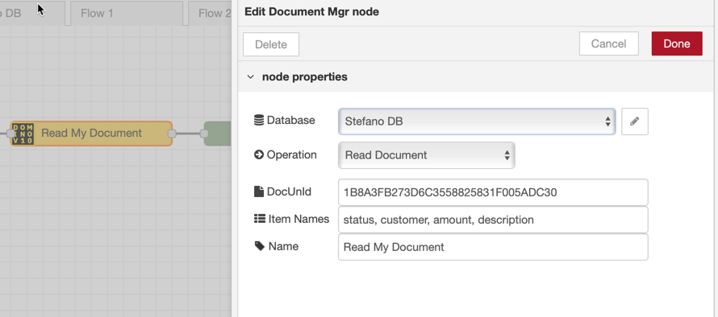

When selecting the **Read Document option**, you can specify a valid **document id** (in the above picture `1B8A3FB273D6C3558825831F005ADC30`)
and the list of items (in the following picture `status, customer, amount, description` as comma-separated items) to be retrieved.
-   The <i style="color:red">DocUnid input</i> can be left empty in the editor. You can use the `msg.DDB_unid` input attribute to provide the information at runtime.
-   The <i style="color:red">Item Names input</i> can be left empty in the editor. You can use the `msg.DDB_itemNames` input attribute (which is, also, a comma-separated list of unique ids) to provide the information at runtime

The output is represented here:

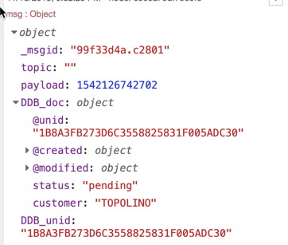

The `msg.DDB_doc` is an object representing the document that has been retrieved, including all the items you asked to retrieve.  
The `msg.DDB_unid` is the unique Id of the document that has been retrieved.

## Replace Document

When selecting the **Replace Document option**, you can specify a valid **document id** (in the above picture `1B8A3FB273D6C3558825831F005ADC30`)
and the comma-separated list of **itemName = 'itemValue'** pairs (in the above picture `attr1='alfa', attr2="123"`) to replace the existing
items for the selected Document. The comma-separated list of **itemName = "itemValue"** pairs contains the items that will be replaced for the selected Document. 
Note that the **itemValue** needs to be <b style="color:red">mandatorily</b> included in single or double quotes.

-   The <i style="color:red">DocUnid input</i> can be left empty in the editor. You can use the `msg.DDB_unid` input attribute to provide the information at runtime.
-   The <i style="color:red">Item Values input</i> can be left empty in the editor. You can use the `msg.DDB_itemValues` input attribute. This attribute is an array of objects formatted in the following way: 
    

The output is represented here:

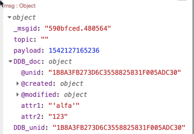

The `msg.DDB_doc` is an object representing the document that has been replaced, including all the items you asked to replace.  
The `msg.DDB_unid` is the unique Id of the document that has been replaced.

## Replace Items

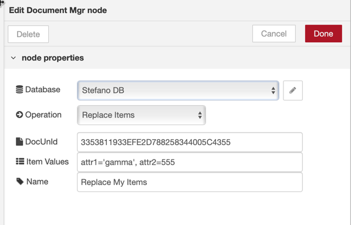

The behavior, in this case, is very similar to the one of the **Replace Document option**. 
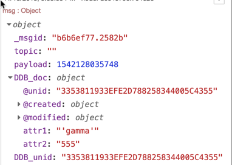

## Delete Document

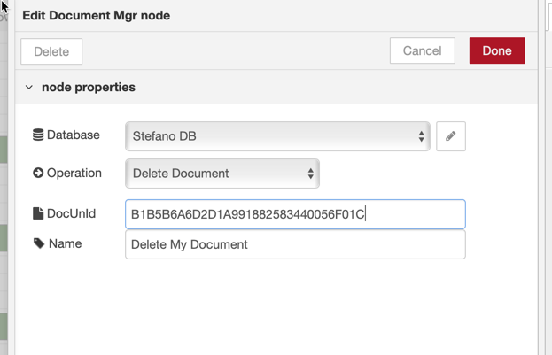

When selecting the **Delete Document option**, you can specify a valid **document id** (in the above picture `B1B5B6A6D2D1A991882583440056F01C`).
-   The <i style="color:red">DocUnid input</i> can be left empty in the editor. You can use the `msg.DDB_unid` input attribute to provide the information at runtime.

The output is represented here:

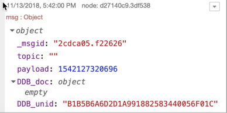

The `msg.DDB_doc` is an empty object.  
The `msg.DDB_unid` is the unique Id of the document that has been deleted.

## Delete Items

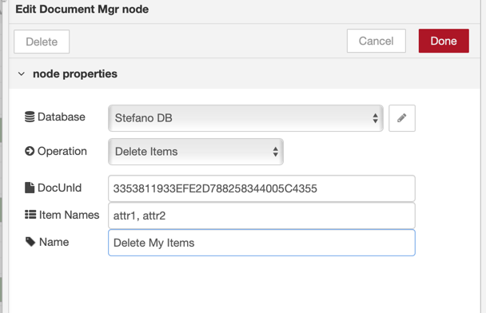

When selecting the **Delete Items option**, you can specify a comma-separated list of item Names (in the following picture `attr1, attr2`) to be removed from an existing Document.
-   The <i style="color:red">Item Names input</i> can be left empty in the editor. You can use the `msg.DDB_itemNames` input attribute (which is, also, a comma-separated list of unique ids) to provide the information at runtime

The output is represented here:

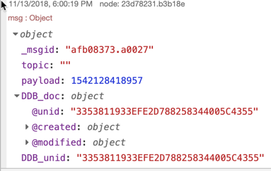

The `msg.DDB_doc` is an object representing the document whose items have been deleted.  
The `msg.DDB_unid` is the unique Id of the document whose items have been deleted.

## Create Document

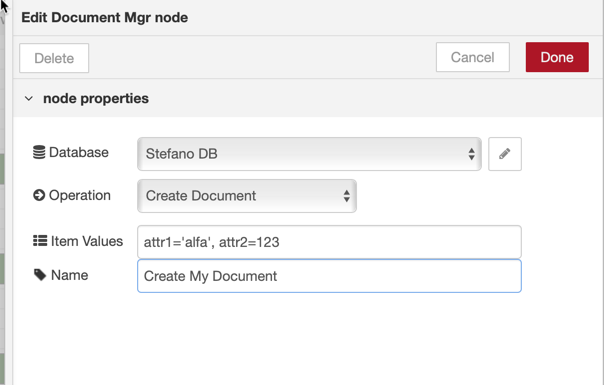

When selecting the **Create Document option**, you can specify a comma-separated list of **itemName/itemValues pairs** (in the following picture `attr1='alfa', attr2=123`) to populate the newly created Document.
-   The <i style="color:red">Item Values input</i> can be left empty in the editor. You can use the `msg.DDB_itemValues` input attribute. This attribute is an array of objects formatted in the following way: 
    

The output is represented here:

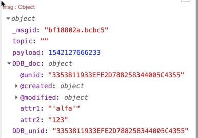

The `msg.DDB_doc` is an object representing the document that has been created, including all the items you asked to create.  
The `msg.DDB_unid` is the unique Id of the document that has been created.
