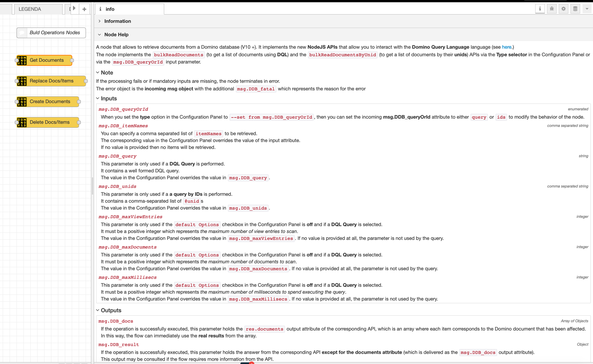
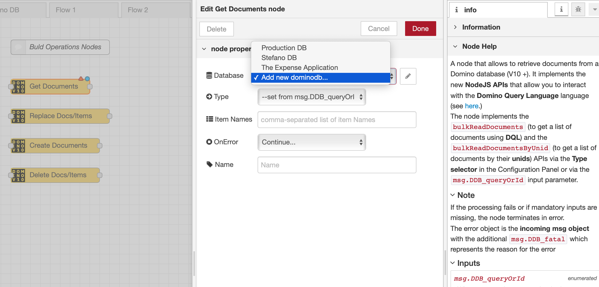
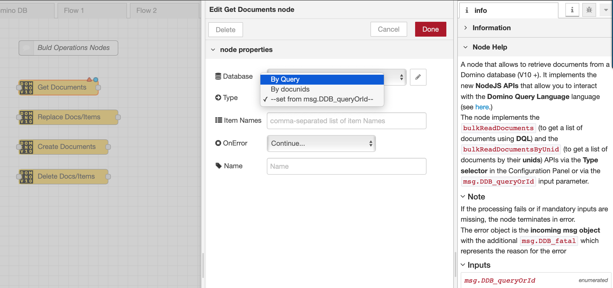
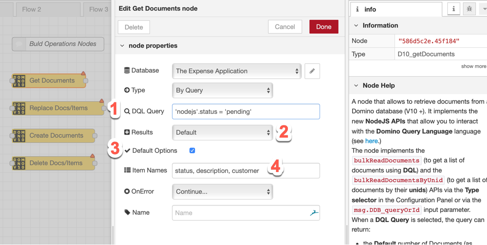
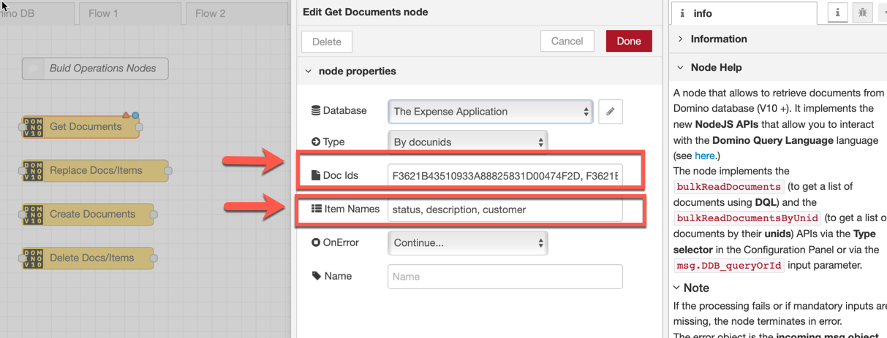
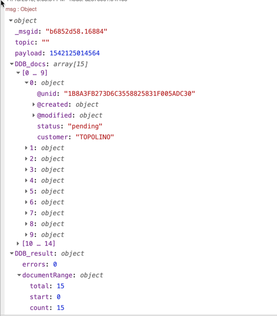
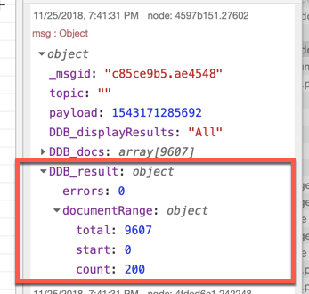

A node that allows to retrieve documents from a Domino database. 
The node implements the `bulkReadDocuments API` (to get a list of documents using the **Domino Query Language** [language](https://www-01.ibm.com/support/docview.wss?uid=ibm10729047)) and the `bulkReadDocumentsByUnid API` (to get a list of documents by their **unids**) via the <i style="color:red">Type selector</i> in the Configuration Panel or via the `msg.DDB_queryOrId` input parameter (valid values are **query** or **ids**).

Clicking on any instance of the node, you can see the online help in the rightmost panel of the Node-RED editor: 

The help describes the behavior of the node as well as all the input and output parameters for the node itself.

### Selecting the Domino Server and Database
You can select the instance of your Domino Database using the <i style="color:red">Database selector</i>: 
 

This provides access to the library of **dominodb configurations**.

### Selecting the operation
By means of the <i style="color:red">Type selector</i>, you can choose to retrieve the documents identified by a **DQL Query** or by specifying the list of Unique Ids associated to each document. 

It is, also, possible to configure the node to delegate to the incoming `msg.DDB_queryOrIds` attribute the kind of operation to be performed.
This is useful when, in your flow, you may want to decide which type of operation to perform based on the status of your flow (valid values are **query** or **ids**).
-   In this case, you will also have to provide input attributes for the
    **DQL Query** string (as `msg.DDB_query`) or for the list of Unique Ids (as `msg.DDB_unids`)

### DQL Query
When selecting the **By Query option**, you can specify a valid **DQL Query** (in the following picture `'nodejs'.status = 'pending'`) and the
list of items (in the following picture `status, customer, description` as comma-separated items) to be retrieved. 

-   The <i style="color:red">DQL Query input</i> can be left empty in the editor. You can use the `msg.DDB_query` input attribute to provide the information at runtime.
-   The <i style="color:red">Results selector</i> allows to define the documents that will be returned. 
    The possible values are: 
    
    -   **Default**: 
        In this case the query will be executed without specifying any *start* and *count* parameters. Only those documents which match the default criteria (from index "0" to index "99") will be retrieved
    -   **All Documents** 
        In this case all documents matching the query will be returned. 
        Be aware that this may be a huge number which may make your NodeRED environment getting out of Memory.
    -   **By Page** 
        In this case, you will be asked to specify the *start* and *count* options in order to retrieve "**count documents starting at the start index**"
        -   The *start* and *count* parameters can also be specified by the incoming `msg.DDB_startValue` and `msg.DDB_countValue`. 
            The values in the configuration panel override the incoming values.
    -   <strong>---set from DDB_displayResults--</strong> 
        The incoming `msg.DDB_displayResults` can be used to provide the information at runtime. Valid values are "**Default**", "**All**" and "**byPage**".
-   In the above picture, we are using **Defaults Options** for the query.
    You can override them by unchecking the <i style="color:red">Default Options checkbox</i> and specifying different values for the `Max View Entries`, `Max Documents` and `Max Milliseconds` parameters). 
    
-   The <i style="color:red">Item Names input</i> can be left empty in the editor. You can use the `msg.DDB_itemNames` input attribute (which is, also, a comma-separated list of unique ids) to provide the information at runtime.

### Getting documents by Unique Ids
When selecting the **By UniqueIds option**, you can specify the list of Unique Ids (as comma-separated list of items) representing the documents
to be retrieved and the list of items (in the following `picture status, description, customer` as comma-separated items) to be retrieved. 

-   The <i style="color:red">Doc Ids input</i> can be left empty in the editor. You can use the `msg.DDB_unids` input attribute (which is, also, a comma-separated list of unique ids) to provide the information at runtime
-   The <i style="color:red">Item Names</i> input can be left empty in the editor. You can use the `msg.DDB_itemNames` input attribute (which is, also, a comma-separated list of unique ids) to provide the information at runtime.

### Output

If the execution of the node successfully completes, the following
outputs will be provided:

The `msg.DDB_docs` array provides a list of Unique Ids representing the documents that have been deleted or the items of which have been
deleted.

The `msg.DDB_result` object contains the additional outputs provided by the API, including the total number of documents matching the query, the
start index and the count value. 

