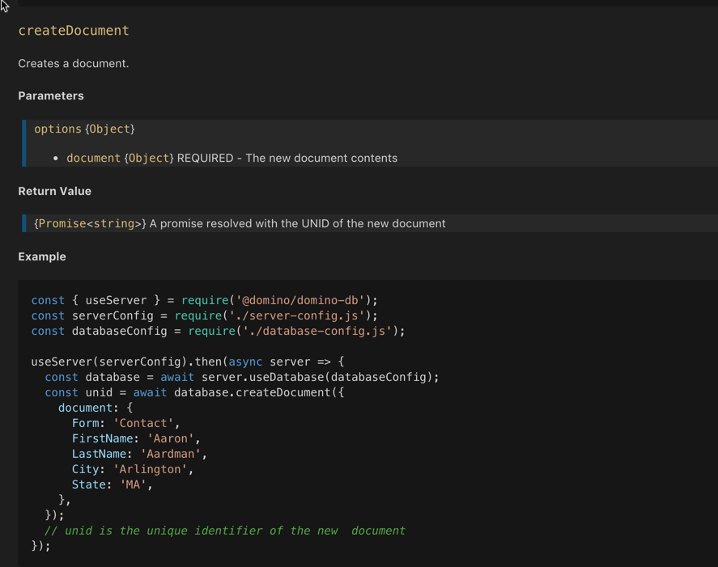

One of the important news happening with the Domino 10 launch is the
possibility to use the NodeJS programming model to interact with the
Domino 10 runtime.

As part of this evolution, our partner HCL has published

-   the **"App Dev Pack"**, which is the server-side component that
    allows a Domino 10 installation to support a new set of APIs and the
    new "Domino Query Language"

-   and the **"domino-db NPM"** component, which provides a NodeJS
    package that allows NodeJS developers to simply and easily create
    applications that make use of the features exposed by the **"App Dev
    Pack"**.

It is not the goal of this article to drill in the details of how to
install and configure the "App Dev Pack". In what follows, we assume
that this server-side component is installed and functioning on your
Domino 10 server.

This article focuses on how a power user can, transparently, use the
**"domino-db NPM"** component by means of the new **Node-RED dominodb
package**. This new Node-RED package aims to provide a very simple and
programmer-friendly abstraction of the APIs exposed by the "**domino-db
NPM**" package in order to make it simple, even for not NodeJS experts,
to create integrations with Domino 10 with "very little" or "no
programming" skills.

The APIs exposed by the **"domino-db NPM"** component allow to perform
**CRUD operations** on a given Domino Database. Those APIs are described
in the README.md and Reference.md files included in the NPM package.
There are, roughly, 3 types of APIs:

-   **APIs that work on "sets" of documents.** 
    You can:

    -   Get a set of documents specified either by a DQL Query or by a
        list of unique Ids
    -   Replace a set of documents (or a set of items within the
        documents) specified either by a DQL Query or by a list of
        unique ids
    -   Delete a set of documents (or a set of items within the
        documents) specified either by a DQL Query or by a list of
        unique ids
    -   Create a set of documents

-   **APIs that work on a single document.** 
    You can Read, Replace, Delete or Create a document specified by its
    unique id

-   **Service APIs.** 
    These APIs allow you to connect to a Domino Server, to select a
    Domino database to work with, to get information about the
    connection that has been established. 
    An interesting Service API allows the programmer to **explain a DQL
    Query** before running it. It can become extremely useful when
    evaluating the optimal way to query a large Domino database.

The use of these APIs requires some familiarity with advanced Javascript
programming (promises, the new Async features of ES6, error management
etc. 
This may quickly become an obstacle for **power users** or for **Domino
programmers** who are more focused on the business logic and/or on the
data that need to be manipulated. Here is an example of the code
fragment that is required to create a single document using the new
APIs.

<strong><u>Note: </u></strong>

this article is based on the V 0.9.7 version of the **node-red-contrib-dominodb** package.  
This simple set of nodes can be used to quickly and safely access to,
virtually, all the APIs exposed by the "**domino-db NPM" component**.
The **"domino-db NPM" component** is a pre-requisite for the Node-RED
package and needs to be installed before the
**node-red-contrib-dominodb** Node-RED package (please refer to the
*Installation section* of the package for details).

