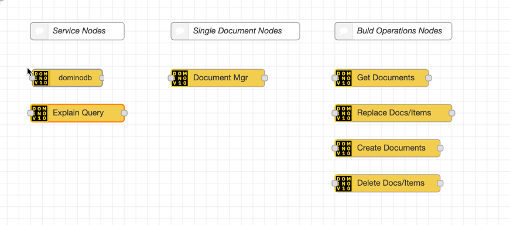
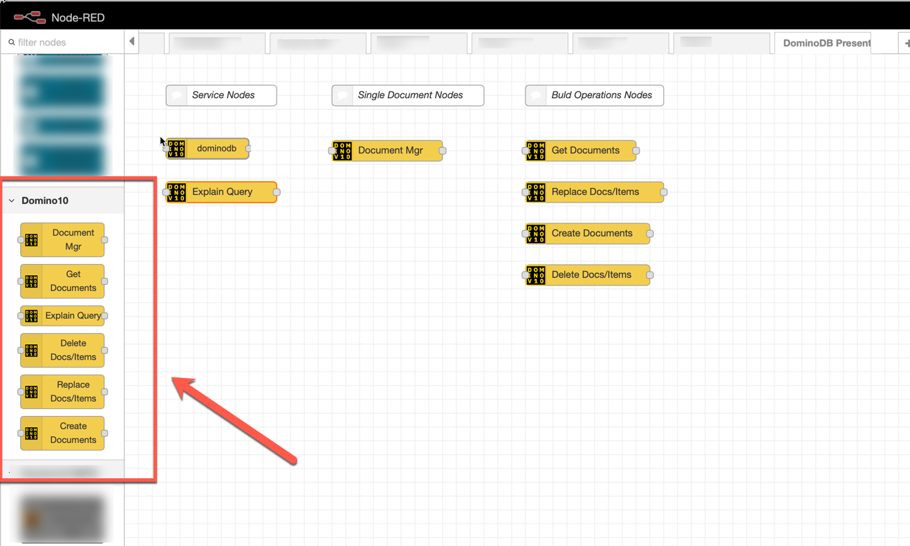
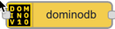
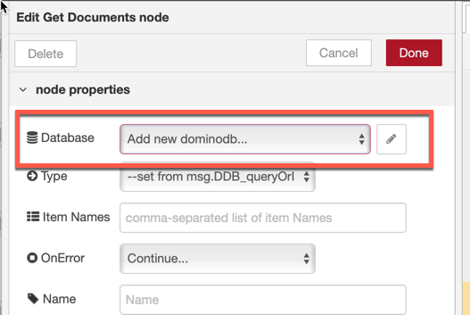
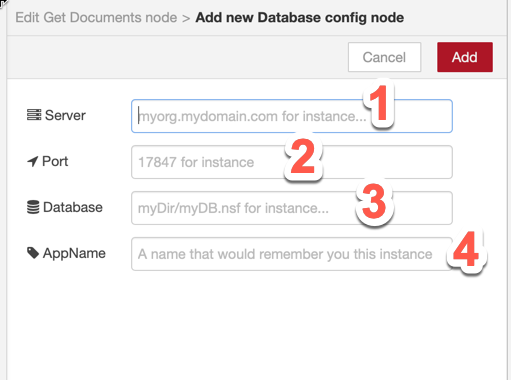
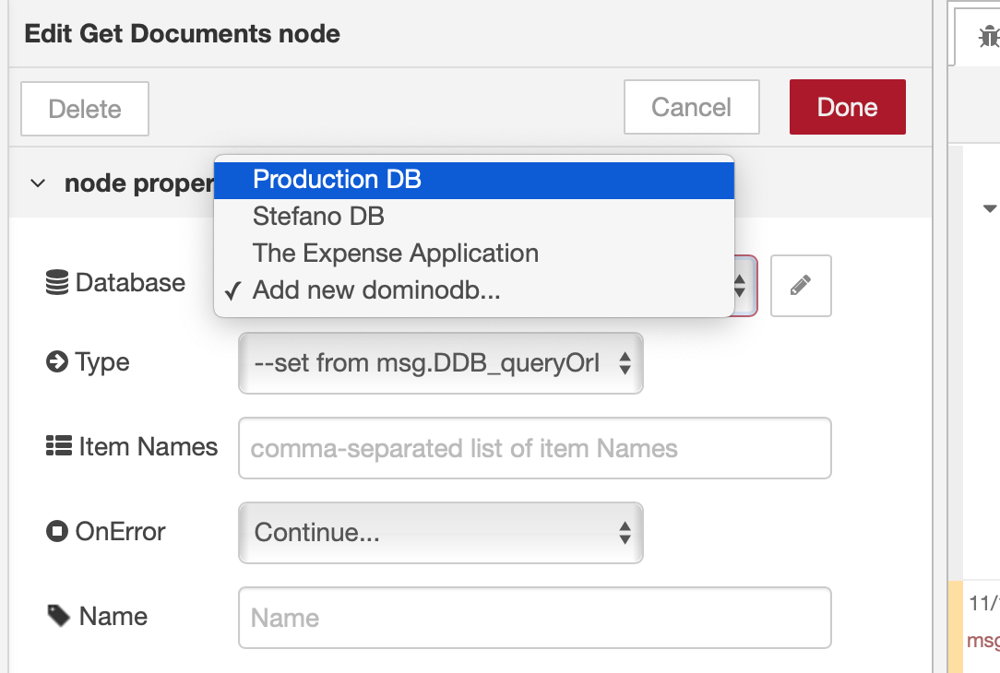
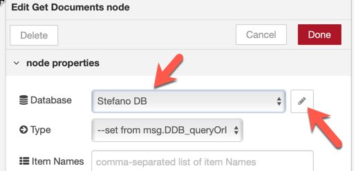

Node-RED (https://nodered.org/), which crisply defines itself as
"*Flow-based programming for the Internet of Things*" is the tool that
we have used to abstract the use of the standard APIs.\
Roughly, we encapsulated the access to the standard APIs as Node-RED
nodes and we provided a simpler way to execute those APIs as part of a
"flow".\
Let's see the details.

### The Domino 10 Node-RED nodes

The **node-red-contrib-dominodb** Node-RED package
(https://flows.nodered.org/node/node-red-contrib-dominodb) provides the
following nodes:

Each node, by selecting an instance of the **dominodb node** (see
[here](#the-configuration-node-dominodb)), implements all the code (and
error management) to properly connect to a Domino Server and to a
selected Domino database; you, as the creator of the flow, simply need
to select the right instance of the **dominodb node** on which to act
upon.

Most of the nodes encapsulate the use of more than one APIs, thus
allowing you to select which functional operation to execute instead
than spending your time in understanding which API (and which
parameters) to use.

The list of available nodes is shown under the **Domino 10 Category** on
the left palette of the Node-RED\
editor, as shown here:

<strong><u>Note: </u></strong>

this article is based on the V 0.9.7 version of the **node-red-contrib-dominodb** package. \
This simple set of nodes can be used to quickly and safely access to,
virtually, all the APIs exposed by the "**domino-db NPM" component**.
The **"domino-db NPM" component** is a pre-requisite for the Node-RED
package and needs to be installed before the
**node-red-contrib-dominodb** Node-RED package (please refer to the
*Installation section* of the package for details).

<strong><u>Note: </u></strong>

In order to enable verbose logging for the nodes contained in the
**node-red-contrib-dominodb** package, you need to set the value of the
d10Debug environment variable to true.

### The Configuration Node (dominodb)

A special role is reserved to the **dominodb node**:
\
This node (a *Configuration node*, in Node-RED parlance) defines a
configuration for the Domino Server and Domino Database that will be
used by all the other nodes.

Since this is a *Node-RED Configuration node*, you can save multiple
instances of the **dominodb node** configuration, allowing you to select
on which database your other nodes will act upon; for instance, you can
create several **dominodb Configuration nodes** to represent several
Domino databases (on the same Domino Server or on different servers).

##### Create a dominodb node

All the nodes in the **node-red-contrib-dominodb** package (they are all
described in the following "[Details of the dominodb Node-RED
package](#details-of-the-dominodb-node-red-package)" section), allow you
to select the **dominodb node** that will be used via the *Database
dropdown* selector:

When you need to create a configuration for a new Domino Database on a
given server, you select, from the dropdown, the Add new dominodb...
option and you click on the pencil icon on its right.

This opens the editor for configuring a new connection:

You need to provide the details for your server (1), the port (2) and
the location of the Domino Database you want to use (3).

We suggest adding a label (4) that will uniquely identify that Database
instance.

When you click on the *Add button*, your configuration will be created
and stored.

As mentioned above, you can have multiple **dominodb configuration
nodes** and they will all be available via the *Database dropdown
selector* for all other nodes in the package.

You can modify any previously created **dominodb configuration node** by
selecting it in the *Database dropdown selector* and clicking on the
pencil icon:

