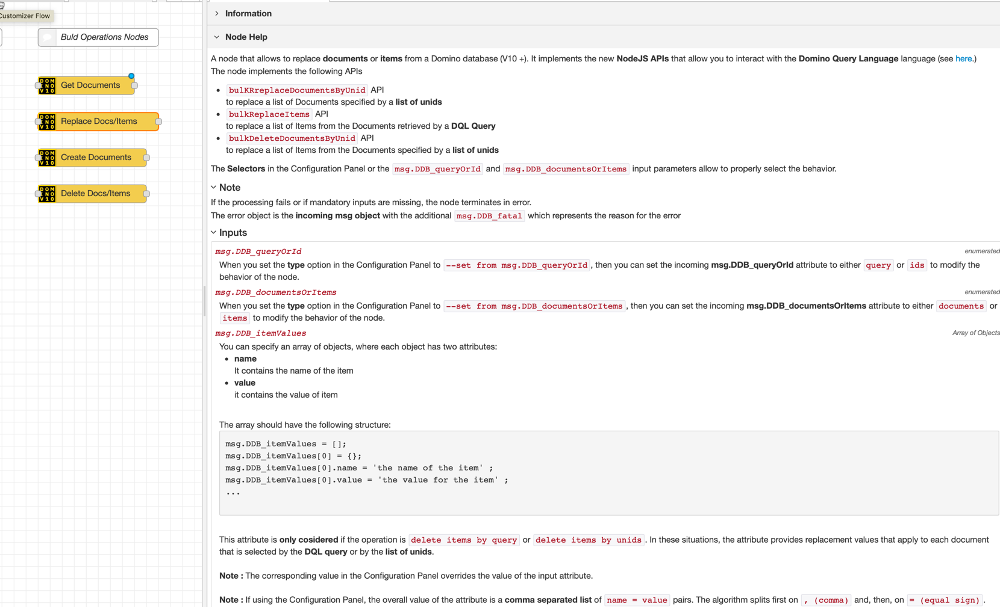
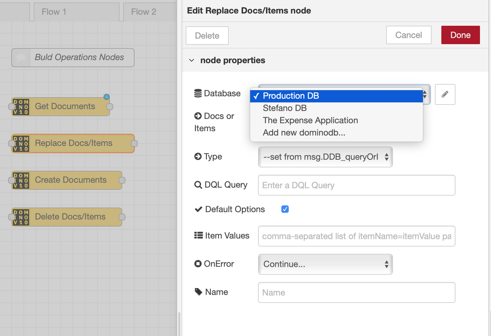
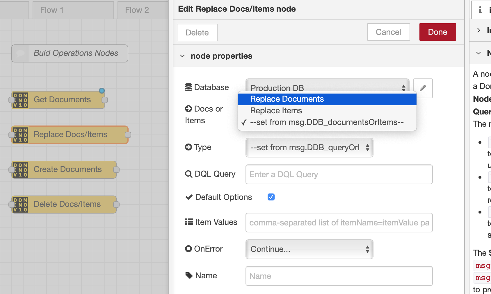
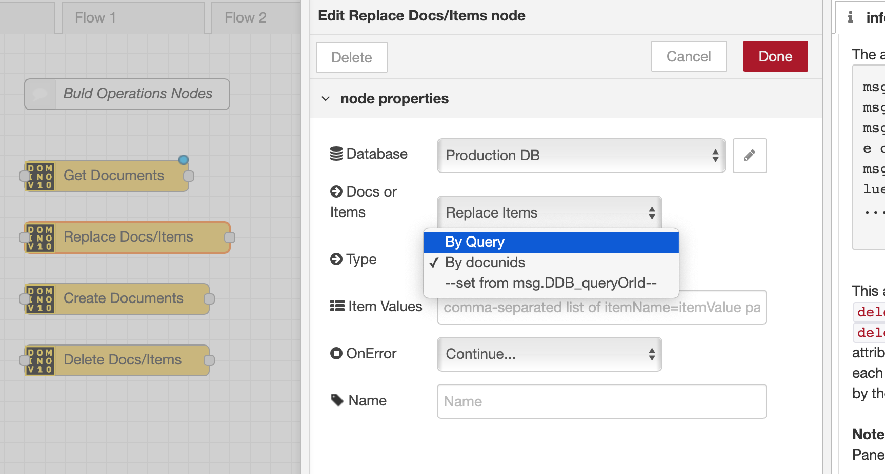
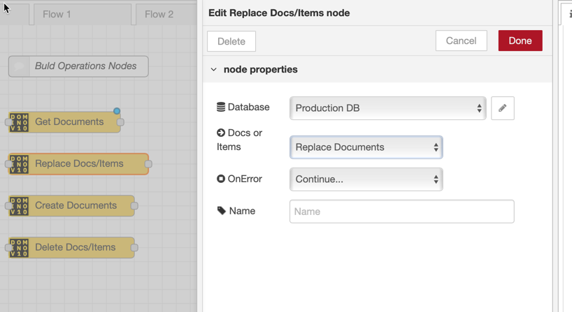
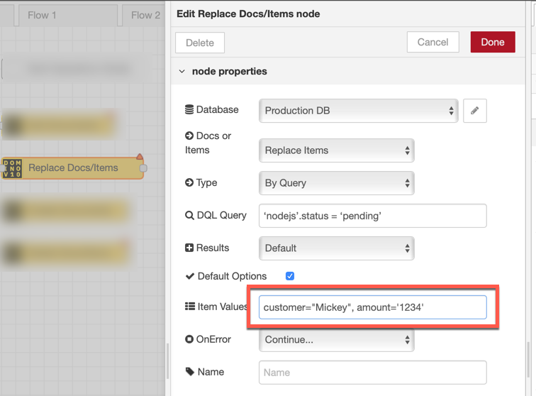
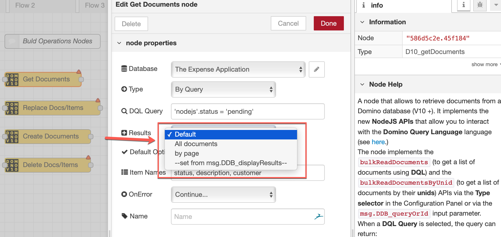
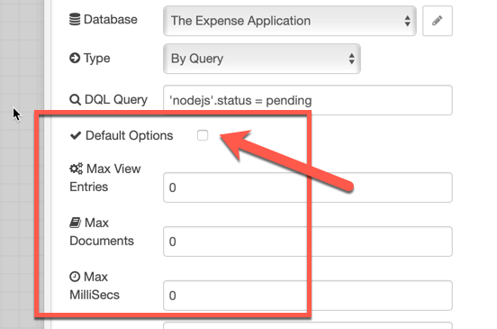
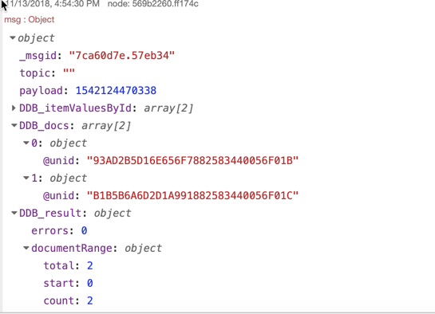

A node that allows to replace **documents** or **items** from a Domino
database (V10 +). It implements the new **NodeJS APIs** that allow you
to interact with the **Domino Query Language** [language](https://www-01.ibm.com/support/docview.wss?uid=ibm10729047). 
The node implements the following APIs:
-   `bulKRreplaceDocumentsByUnid API`  
    to replace a list of Documents specified by a **list of unids**
-   `bulkReplaceItems API`  
    to replace a list of Items from the Documents retrieved by a **DQL     Query**
-   `bulkReplaceDocumentsByUnid API`  
    to replace a list of Items from the Documents specified by a **list of unids**

Clicking on any instance of the node, you can see the online help in the
rightmost panel of the Node-RED editor: 

The help describes the behavior of the node as well as all the input and
output parameters for the node itself.

### Selecting the Domino Server and Database
You can select the instance of your Domino Database using the <i style="color:red">Database selector</i>: 
 

This provides access to the library of **dominodb configurations**.

### Selecting the target
By means of the Docs or Items selector, you can choose to replace entire
documents or the value of certain items within the selected documents. 

It is, also, possible to configure the node to delegate to the incoming `msg.DDB_documentsOrItems` attribute the kind of operation to be performed. This is useful when, in your flow, you may want to decide which type of operation to perform based on status of your flow (vaid values are **documents** or **items**)
-   In this case, you will also have to provide input attributes for the
    **DQL Query** string (as `msg.DDB_query`) or for the list of Unique Ids (as `msg.DDB_itemValuesById`).

### Selecting the operation
By means of the <i style="color:red">Type selector</i>, you can choose to replace the documents identified by a **DQL Query** or by the list of Unique Ids associated to each document. 

It is, also, possible to configure the node to delegate to the incoming
`msg.DDB_queryOrIds` attribute the kind of operation to be performed. This is useful when, in your flow, you may want to decide which type of operation to perform based on the istatus of your flow (valid values are **query** or **ids**).
-   In this case, you will also have to provide input attributes for the **DQL Query** string (as `msg.DDB_query`) or for the list of Unique Ids (as `msg.DDB_itemValuesById`).

<strong><u>Note: </u></strong>

This <i style="color:red">Type Selector</i> is only shown if you selected  **Replace Items** from the previous selector. 
In case you selected **Replace Documents**, the **DQL Query** option is not currently supported by the APIs.

##### Replacing Documents

If you elected to replace entire documents, you will see the following panel:

Apparently, you cannot specify which Documents you actually want to replace. This is normal. 
Actually, the API that will be used when you elected to be in this situation is the `bulkReplaceDocumentsByUnid API`. This API accepts an array of objects, where each object holds the `@unid` attribute in addition to the name and values of the other items that will be assigned to the new Domino documents that will replace the old ones. 
It is not really simple to write a complex array of JSON objects in an input text. So, the `msg.DDB_itemValuesById` input attribute will be used.

Here below is a simple example of how this attribute can be built by a
**Function Node** and passed to **the Replace Doc/Items node**.

##### Replacing Items by Query

If you want to replace items within documents by specifying a **DQL Query**, you will see the following panel:

You can specify a valid **DQL Query** (in the above picture `'nodejs'.status = 'pending'` ) and a comma-separated list of **itemName = "itemValue"** pairs (in the above picture `customer="Mickey", amount='1234'`). The comma-separated list of **itemName = "itemValue"** pairs contains the items that will be replaced for all Documents matching the DQL query. 
Note that the **itemValue** needs to be <b style="color:red">mandatorily</b> included in single or double quotes.

-   The *DQL Query input* can be left empty in the editor. You can use the `msg.DDB_query` input attribute to provide the information at runtime.

-   The *Results selector* allows to define the documents that will be replaced. 
    The possible values are: 
    

    -   **Default**: 
        In this case the query will be executed without specifying any *start* and *count* parameters. Only those documents which match the default criteria (from index "0" to index "99") will be replaced

    -   **All Documents** 
        In this case the items for all the documents matching the query will be replaced. 
        Be aware that this may be a huge number which may make your NodeRED environment getting out of Memory.

    -   **By Page** 
        In this case, you will be asked to specify the *start* and *count* options in order to replace "**count documents starting at the start index**"

        -   The *start* and *count* parameters can also be specified bythe incoming `msg.DDB_startValue` and `msg.DDB_countValue`. 
            The values in the configuration panel override the incoming values.

    -   **set from DDB_displayResults** 
         The incoming `msg.DDB_displayResults` can be used to provide the information at runtime. Valid values are "**Default**", "**All**" and "**byPage**".

-   In the picture below, we are using *Defaults Options* for the query. You can override them by unchecking the *Default Options checkbox* and specifying different values for the Max View Entries, Max Documents and Max Milliseconds parameters). 
    

-   The *Item Values input* can be left empty in the editor. You can use the `msg.DDB_itemValues` input attribute (which is an array of JSON objects formatted in the following way: 
    

##### Replacing Items by Unique Ids

If you want to replace items within documents by specifying a list of **unique Ids**, you will see the following panel:

You can specify a comma-separated list of **itemName = "itemValue"** pairs (in the above picture `customer="Mickey", amount='1234'`). 
Note that the **itemValue** needs to be <b style="color:red">mandatorily</b> included in single or double quotes.

-   The *Item Values input* field defines the changed attributes that will apply to all the selected documents.
-   The *Item Values input* can be left empty in the editor. You can use the `msg.DDB_itemValues` input attribute (which is an array of JSON objects formatted in the following way: 
    

In order to provide the list of unique ids for replacing the items, we need to go back to the API used in this situation, which is the 
`bulkReplaceItemsByUnid` API. This API accepts, among other parameters, an array of objects, where each object holds the `@unid` attribute in
addition to the name and values of the other items that will be assigned to the new Domino documents that will replace the old ones. 
It is not really simple to write a complex array of JSON objects in an input text. So, the `msg.DDB_itemValuesById` input attribute will be
used.

Here below is a simple example of how this attribute can be built by a **Function Node** and passed to **the Replace Doc/Items node**.

##### Controlling the behavior and appearance of your instance

-   You can specify the behavior of the API in case of error 
    

-   Do not forget to give a meaningful name to your newly created node 
    

##### Output

If the execution of the node successfully completes, the following outputs will be provided:

The `msg.DDB_docs` array provides a list of Unique Ids representing the documents that have been deleted or the items of which have been
deleted.

The `msg.DDB_result` object contains the additional outputs provided by the API, including the total number of documents matching the query, the
start index and the count value. 

