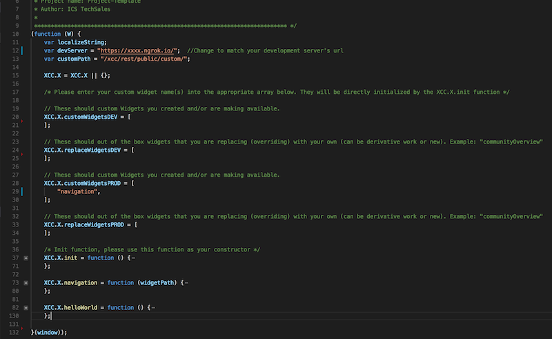

Return to Visual Studio Code and in the left navigation expand **src** > **widgets** and click on custom.js to open it. This is the same exact custom.js that we uploaded to the server earlier when we imported the labpages.zip.  

 
`custom.js` is an entry point that is used to add any custom widget that you develop.  You are free to tailor it to what you feel most comfortable with.  We modified it for this lab to simplify our development/testing/production deployment of widgets. We will now explore the features in our tailored `custom.js` file.

 
This picture shows all the major sections of the custom.js collapsed. We will refer to the line numbers on the left-hand side as we describe each of the sections.  
 

- In lines 11 through 13 we declare global variables that we will use in our widgets later on:  
    * The `localizeString` is a variable that we are declaring here for it to be global and we will initialize it later on in the init section.
    * The `devServer` is used to specify where our development server is.  We can host widgets on our development server and very easily make updates to the widget without having to redeploy it to the ICEC server. You need to update the value of that variable to match the URL for your development server which you started earlier.  Make sure to keep the ending `/`.
    * The `customPath` is used to specify where custom widget(s) are deployed in 'Production', i.e. hosted on the ICEC server.  The default path is `/xcc/rest/public/custom/` and should not be changed.

- In lines 20 to 34 we have four (4) array variables that we declare and initialize as follows:
    * XCC.X.customWidgetsDEV: Array of name(s) of the custom widget(s) that will be served from our development server (devServer variable above).
    * XCC.X.replaceWidgetsDEV: Array of name(s) of the custom widget(s) that will be served from our development server (devServer variable above) and replace out-of-the-box widgets.
    * XCC.X.customWidgetsPROD: Array of name(s) of the custom widget(s) that will be served from the ICEC server (customPath variable above).
    * XCC.X.replaceWidgetsPROD: Array of name(s) of the custom widget(s) that will be served from the ICEC server (customPath variable above) and replace out-of-the-box widgets.

- In lines 37 to 71, we loop through the above arrays and call the necessary ICEC functions to either add a widget or replace the out-of-the-box widget with the widgets that are added to the custom.js

- Lines 73 and 82 start sections for two(2) custom widgets:
    * navigation: This is the widget we added to our pages in an earlier step
    * helloWorld: This is the classic Hello World example widget that we will be walking through in the next section.   

We will build four (4) widgets in this lab and in the process we will be revisiting the `custom.js` to add additional sections and modify the arrays above, so there will be plenty of time to get even more familiar with it.