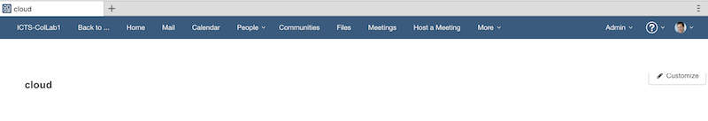

---

Note
If this is your very first time using ICEC, we recommend you take a few minutes to review the <a href="https://www.ibm.com/developerworks/collaboration/library/icec-getting-started/index.html" target="_blank">Getting started with IBM Connections Engagement Center for Developers</a> topic.  

Note
If you have used ICEC before and are familiar with how to create pages and add widgets to those pages, you may skip that step.

During the lab we will provide you with a shortcut for creating the pages and the navigation that are required. 

---

### Log in using Chrome
ICEC is installed as an add-on to IBM Connections that is available on-premises and in the cloud.  You access it with one of the following URIs: 
 - /xcc/main (on-prem) 
 - /xcc/cloud (cloud)

For this lab, we will be using Chrome as the browser and a Connections Cloud environment at the following URL: <a href="https://apps.na.collabserv.com/xcc/cloud" target="_blank">https://apps.na.collabserv.com/xcc/cloud</a>

Launch the web site using the Chrome browser and log in using the credentials that were assigned to you by the lab facilitators.

When you first log in, you see an empty page similar to this:

