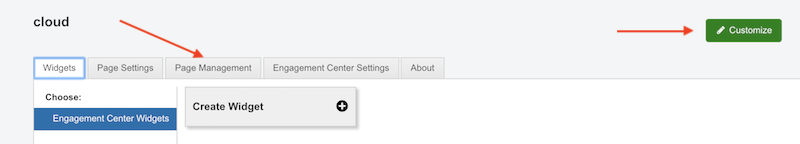
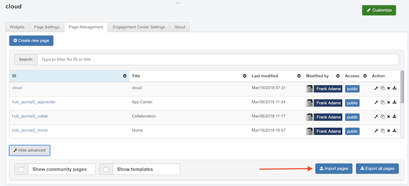
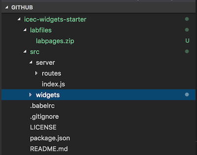
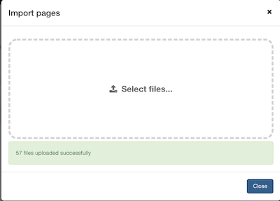
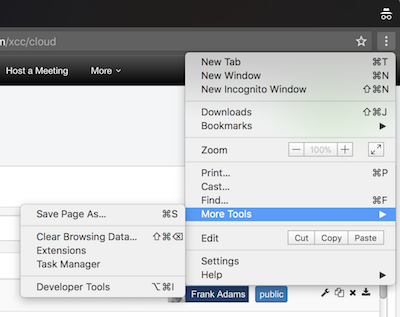
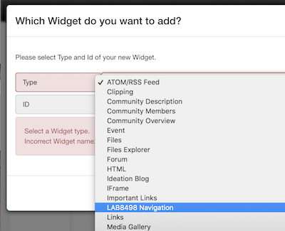
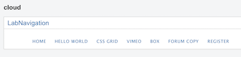
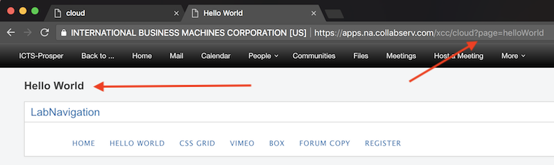

---

Warning

This step will import a number of files to your ICEC environment including a default `custom.js` which will replace your existing `custom.js`. If you need to keep your existing customizations (if any), you need to make a backup of your `custom.js` before importing the files below. 

Safe for Lab

---

<a name="top"/>

 

<a name="pagemanagement"/>

###### 1. Open Page Management  

Click on **Customize** > **Page Management**  

 
<a name="importpages"/>

###### 2. Select Import pages  
Click on **Show Advanced** > **Import pages**

 
<a name="importlabfiles"/>

###### 3. Import labpages.zip  

The Github repository that you cloned earlier contains a zip file called `labpages.zip`. (Do not unzip the file unless you need to modify it.)  

Click Select files and navigate to the location of that zip file, then click Open.  You will receive a result similar to the screen below.  Click OK.

 
<a name="browsercache"/>

###### 4. Refresh your browser cache  

The `custom.js` that we just loaded is not in your browser cache. Open the Chrome developer tools **More Tools** > **Developer Tools**

Click and hold on the Refresh page icon in the browser until a drop down menu is presented and click on `Empty Cache and Hard Reload`

The page will reload with the new `custom.js` loaded.  You may now close the Developer Tools; however, as you make updates to the `custom.js` throughout the lab, you will need to repeat the above steps to ensure you are viewing your latest changes.  

 
<a name="addwidget"/>

###### 5. Add the **Lab Navigation** widget to the page  

By default when you started from the /xcc/cloud uri, you were placed on the `cloud` page.  We 'created' five (5) pages during the import process above to host each of the five (5) widgets we will be developing during this lab. We will now add a pre-built navigation widget to this `cloud` page you are on to facilitate quick switching to these other pages. 

Click on **Customize** > **Widgets** > **Create Widget** 

Select the `LAB8498 Navigation` widget from the list and in the ID field enter a unique name **LabNavigation** and click on **Create**.

A widget similar to the one below should now be added to the page.

 
<a name="syncpages"/>

###### 6. Configure all pages to the same navigation  

We now need to add the same navigation widget to all the pages we created.  There are two methods available to us: 
* Add the same widget to each page individually or 
* Make the page we already added the widget on - the `cloud` page - a template and have all the other pages inherit from that template.  

We will do the second option in this lab. The pages we imported were pre-configured to inherit from the `cloud` page that we are currently on; however, the `cloud` page is not currently known to be a template. Let's change that now: 

ICEC pages are based on grid layouts. To change the grid, you go to “Grid” in “Page Settings” and select the grid you want to use.
- Click on > **Page Settings** > **Grid** and select **Grid 13**. 

- Click on > **Page Settings** > **Show Advanced** and select the **Is Template** check box and click on **Save**. (The page should refresh.)

- Click on **Customize** > **Page Settings** > **Show Advanced** and click on **Synchronize Pages**

Now if you click on each of the navigation links, you are taken to the appropriate ICEC pages (notice the URL and page title changes).

NOTE: If the pages do not have the Lab Navigation widget on them, then there is a bug in our lab.  For each page, you can choose to **Customize** > **Page Settings** > **Show Advanced** and choose `cloud` in the Inherit From drop-down.

[Back to Top](#top)  

