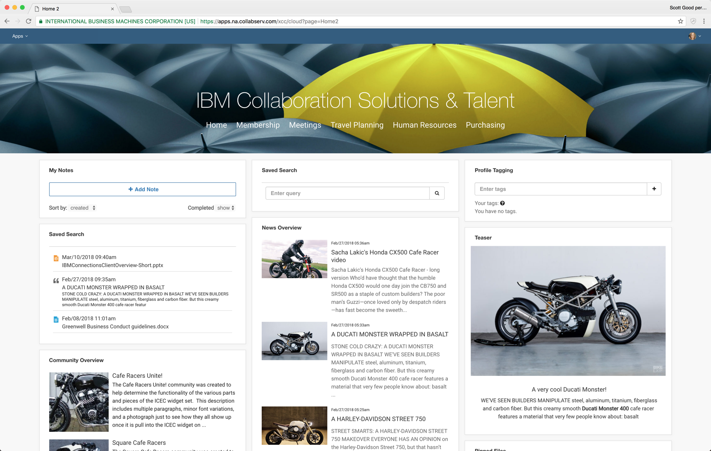

IBM Connections Engagement Center makes it easy to build a social intranet by creating a lightweight portal-like experience using various out-of-the-box and custom widgets. Engagement Center does not have its own content store, but aggregates content from different backend systems. Mostly, IBM Connections is the back-end system, and provides the underlying foundation for a set of key Engagement Center services, such as user authentication and authorization, personalization, top-level navigation, and news.
 

