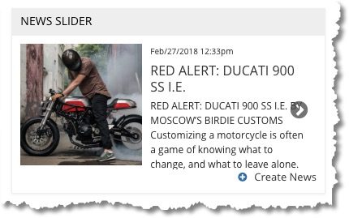
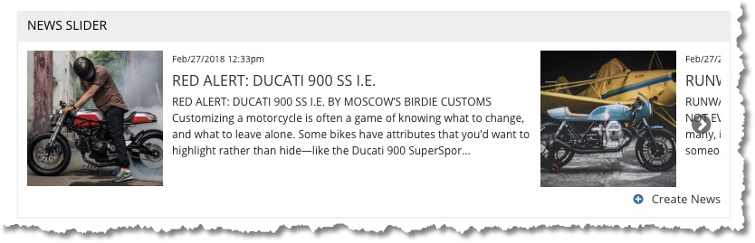
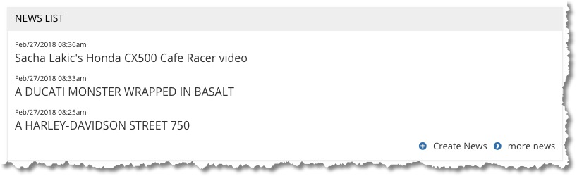
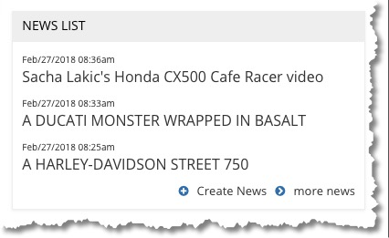
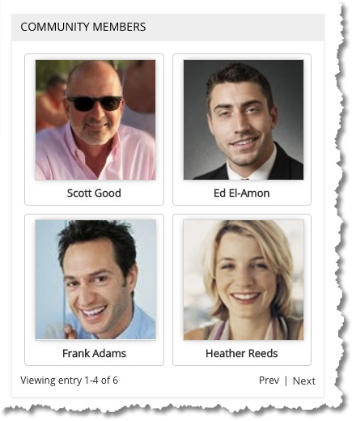
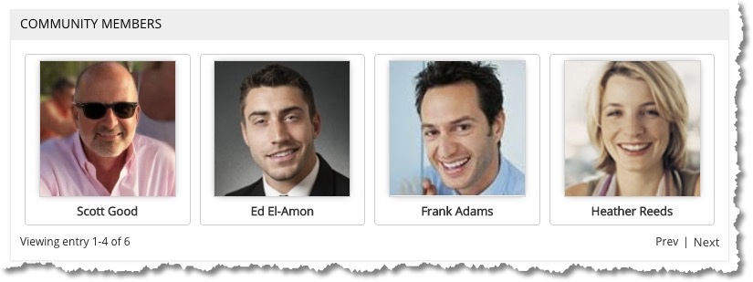
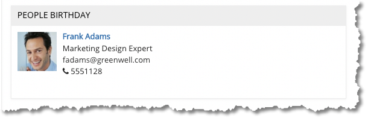
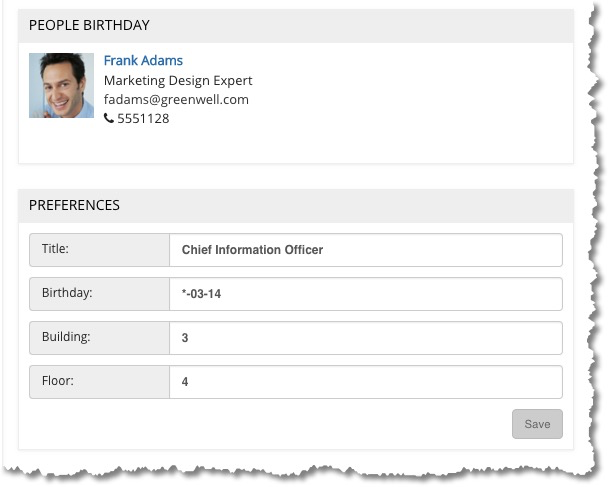

Engagement Center widgets can be embedded in placeholders on every Connections Engagement Center page. Below is a list of widgets that ship with ICEC. This lab focuses on building custom widgets; however, it is important to understand what is available. It is also possible to make a copy of an existing widget to either override it or simply have a slightly modified version.

Widgets on this page are organized by content type and prepared by Scott Good, NA ICS SME team  

<ul class="nav nav-tabs">
  <li class="dropdown">
    <a class="dropdown-toggle" data-toggle="dropdown" href="#">
      Blog widgets 
    </a>
    <ul class="dropdown-menu">
      <li><a href="#blogs1" data-toggle="tab">News Channel or News Slider</a></li>
      <li><a href="#blogs2" data-toggle="tab">News List</a></li>
      <li><a href="#catchall" data-toggle="tab">News Overview</a></li>
      <li><a href="#catchall" data-toggle="tab">People Selector</a></li>
      <li><a href="#catchall" data-toggle="tab">News</a></li>
      <li><a href="#catchall" data-toggle="tab">Static Content – Blog</a></li>
      <li><a href="#catchall" data-toggle="tab">Top News</a></li>
    </ul>
  </li>

  <li class="dropdown">
    <a class="dropdown-toggle" data-toggle="dropdown" href="#">
      People and Profiles widgets 
    </a>
    <ul class="dropdown-menu">
      <li><a href="#profiles1" data-toggle="tab">Community Members</a></li>
      <li><a href="#profiles2" data-toggle="tab">People Birthday (on-prem only)</a></li>
      <li><a href="#catchall" data-toggle="tab">People Finder</a></li>
      <li><a href="#catchall" data-toggle="tab">People Selector</a></li>
      <li><a href="#catchall" data-toggle="tab">Preferences (on-prem only)</a></li>
      <li><a href="#catchall" data-toggle="tab">Profile Completion (on-prem only) </a></li>
      <li><a href="#catchall" data-toggle="tab">Profile Picture (on-prem only)</a></li>
      <li><a href="#catchall" data-toggle="tab">Profile Tagging (on-prem only)</a></li>
      <li><a href="#catchall" data-toggle="tab">Suggestions (on-prem only)</a></li>
    </ul>
  </li>

  <li class="dropdown">
    <a class="dropdown-toggle" data-toggle="dropdown" href="#">
      Community widgets
    </a>
    <ul class="dropdown-menu">
      <li><a href="#catchall" data-toggle="tab">Community Members</a></li>
      <li><a href="#catchall" data-toggle="tab">People Birthday (on-prem only)</a></li>
    </ul>
  </li>

  <li class="dropdown">
    <a class="dropdown-toggle" data-toggle="dropdown" href="#">
      Miscellaneous widgets
    </a>
    <ul class="dropdown-menu">
      <li><a href="#catchall" data-toggle="tab">Community Members</a></li>
      <li><a href="#catchall" data-toggle="tab">People Birthday (on-prem only)</a></li>
    </ul>
  </li>

</ul>

  

     
      
NOTE: The News Channel and News Slider widgets are the same.

      
Displays the first part of the content of blog entries along with the first image from each, regard of where that image is located in the blog post. Wider sizes show hints of the next blog entry, as seen below.

      
RECOMMENDATION: Use square images, not rectangular (at least for the first image).

      
       
      
  

  

     
      
Displays blog entries from specified Communities. Can pull from multiple sources. Displays only headline and creation date. Does not show any of the body, nor photos.

      
       
      
  

  

     
      
Displays the first image and truncated copy from blog entries, with individual entries stacked vertically. Although this will grow to fit any width column, the image grows accordingly but the amount of copy remains constant. Therefore, using this widget in larger areas really doesn’t make a lot of sense.
RECOMMENDATION: Horizontal images are preferred for this widget in the larger usages (as shown on the left below. Square or vertical for smaller applications as on the right.

      
       
      
  

  

     
      
Displays blog entries from specified Communities. Can pull from multiple sources. Displays only headline and creation date. Does not show any of the body, nor photos.

      
       
      
  

   

     
      
As you might expect, shows the members of a community. By default, it shows 5 to a page but that can be changed using the page size setting in the configuration (which is set to 4 in the images here).

      
       
      
  

  

     
    
NOTE: This only works if you have entered the birthday properly in the user's Profile, which requires *-MM-DD format (note the leading asterisk).

      
       
If you directly edit the user Profile, it shows an example of the correct date formatting. However, if you use the Preferences widget (as shown below) or the Profile Completion widget, it will NOT show the correct format and will accept all kinds of formats that won't work.

          
  

  

     
    
Details Coming soon

  

